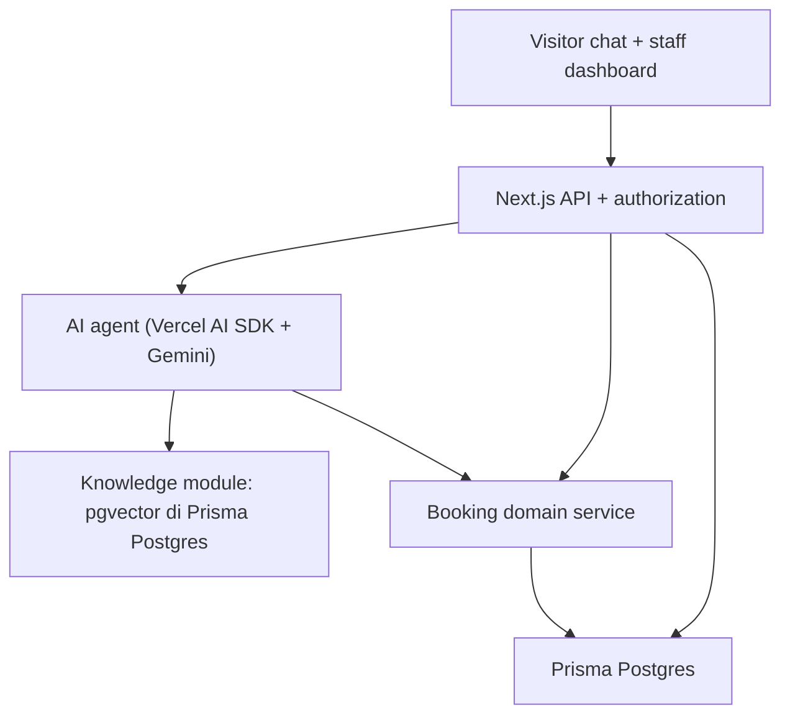

# AI Clinic Front Desk — Rencana Implementasi Bertahap (PLAN v1)

**Tanggal:** 2 Oktober 2026
**Status:** Rencana kerja. Belum ada kode. Menunggu persetujuan sebelum mulai M0.
**Dokumen acuan:** `PRD_MVP_AI_Clinic_Front_Desk.md` (spesifikasi produk & acceptance criteria).
**Peran dokumen ini:** menerjemahkan PRD menjadi urutan milestone yang benar-benar dieksekusi, sekaligus mencatat **revisi stack** yang disetujui pemilik produk.

> Aturan: PRD tetap menjadi sumber kebenaran untuk *apa* yang harus dibangun (FR/AT, aturan bisnis, journey). Dokumen ini mengatur *bagaimana dan dalam urutan apa*.

---

## 0. Keputusan stack (revisi dari PRD)

Tiga keputusan pemilik produk mengubah bagian "Stack wajib" di PRD. Semua perubahan lain tetap mengacu PRD.

| Area | PRD asli | **Keputusan revisi** | Alasan / catatan |
|---|---|---|---|
| ORM | Drizzle ORM | **Prisma ORM** | Perintah pemilik. Wajib raw SQL/TypedSQL untuk `vector`. |
| Database | Neon PostgreSQL | **Prisma Postgres** | Satu layanan DB, gratis untuk dev, dukung `pgvector`. |
| Knowledge retrieval | Supermemory | **`pgvector` di Prisma Postgres** | Supermemory dihapus total dari dependency. |
| AI provider | "model dapat dikonfigurasi" | **Google Gemini (free tier)** via **Vercel AI SDK + `@ai-sdk/google`** | Gratis; interface `generateText`/`streamText`/tool calling. |
| Embedding | (via Supermemory) | **Gemini embedding model** (mis. `gemini-embedding-001`), dimensi dipin | Disimpan di kolom `vector`. |
| Migrations | SQL migrations (Drizzle) | **Prisma Migrate** + custom migration untuk ekstensi | `CREATE EXTENSION`, kolom `vector`, exclusion constraint. |

**Yang tidak berubah:** Next.js App Router, Vercel AI SDK (dipakai sebagai orchestrator streaming/tool), PostgreSQL sebagai sumber kebenaran transaksi, Vercel sebagai target deploy, Node runtime, aturan bisnis & acceptance criteria PRD.

### Konsekuensi wajib (jangan dilewatkan)

1. **Prisma tidak mengenal tipe `vector`.** Kolom embedding ditulis sebagai `Unsupported("vector(N)")` dan hanya diakses lewat `$queryRaw` / TypedSQL. Prisma Studio tidak bisa membuka tabel itu — ini normal, bukan bug.
2. **`prisma dev` (Postgres lokal) = PGlite: satu koneksi saja.** Ia cocok untuk iterasi cepat, **tidak** untuk uji concurrency. Uji AT-08/AT-11/AT-15 harus jalan di Prisma Postgres hosted (atau Postgres ber-`pgvector` sungguhan). Ini diselesaikan sebagai gerbang M0.
3. **`pgvector` di Prisma Postgres masih Early Access.** Harus diverifikasi di M0; bila gagal, modul knowledge punya fallback full-text Postgres tanpa mengubah kontrak modul (lihat §7).
4. **Gemini free tier punya rate limit & kuota harian.** Wajib ada budget guard, retry terbatas, dan fallback form booking manual (PRD §17). Model ID & limit diverifikasi saat setup, jangan dari ingatan.

---

## 1. Prinsip kerja

1. **Vertical slice, bukan frontend dulu lalu backend.** Setiap milestone menghasilkan satu alur yang benar-benar jalan: DB → service → API → UI → test.
2. **Database-first untuk domain transaksi.** Aturan booking, konflik, dan idempotency selesai dan teruji **tanpa AI** (M2) sebelum AI menyentuhnya (M4). AI tidak pernah menulis langsung ke ORM.
3. **Semua mutasi lewat satu domain service.** Endpoint publik, dashboard, dan tool AI memanggil service yang sama (PRD §13).
4. **Setiap task menuliskan: FR/AT terkait, input/output, izin, perubahan schema, failure mode, bukti selesai** (PRD §20).
5. **Tidak ada klaim palsu.** Tidak ada mock yang dipresentasikan sebagai integrasi nyata; kegagalan harus terlihat sebagai kegagalan.
6. **Satu langkah = satu commit yang bisa ditinjau.** Setiap milestone berakhir dengan lint + typecheck + build + test hijau.

---

## 2. Gerbang M0 — Spike verifikasi (paling depan, sebelum bangun apa pun)

Tujuan: membuktikan 3 asumsi risiko tinggi dalam < 1 hari, agar tidak membangun di atas fondasi yang salah.

| Spike | Yang dibuktikan | Cara | Jika gagal |
|---|---|---|---|
| S-DB-1 | Prisma + Prisma Postgres (hosted) bisa connect & migrate | Buat proyek Prisma Postgres gratis, `prisma migrate dev` sederhana | Ganti ke Postgres lokal/Neon, catat di §11 |
| S-DB-2 | `pgvector` + index (HNSW) benar-benar jalan di Prisma Postgres | Custom migration: `CREATE EXTENSION vector`, tabel uji `vector(768)`, insert & query cosine via `$queryRaw` | Aktifkan fallback full-text (§7) |
| S-DB-3 | Concurrency nyata & exclusion constraint | Dua transaksi bersamaan + `btree_gist`/`GIST` exclusion pada `provider_id + tstzrange` | Pakai lock strategi PRD §15 sebagai satu-satunya pertahanan |
| S-AI-1 | Gemini free tier: teks + streaming + tool call + embedding | Skrip kecil via `@ai-sdk/google` | Turunkan model / batasi fitur, catat limit |
| S-VER | Pin versi Prisma & Next.js yang dipakai | Catat di README + lockfile | — |

**Keluaran M0-spike:** satu file `docs/SPIKE_RESULTS.md` berisi perintah, hasil, versi, limit Gemini, dan keputusan (pgvector on/off, DB dev vs prod).

---

## 3. Peta milestone

| Milestone | Nama | Mengacu | Prasyarat | Hasil yang bisa dilihat |
|---|---|---|---|---|
| **M0** | Foundation | PRD E0, FR-01 | spike lulus | App jalan, DB termigrasi, guest session + staff login, CI hijau |
| **M1** | Clinic configuration | PRD E1, FR-13 | M0 | Admin bisa atur layanan/provider/jadwal; seed WellNest |
| **M2** | Booking domain (tanpa AI) | PRD E2, FR-05–09/17/18/21, AT-06–14/17/18/21 | M1 | Availability + create/reschedule/cancel atomik & idempotent |
| **M3** | Knowledge + retrieval | PRD E3, FR-03/14, AT-01/03 | M0 | Dokumen versi, approve, embed, retrieve + citation |
| **M4** | Chat agent | PRD E4, FR-02/04, AT-01/02/05 | M2, M3 | Chat streaming, tool, booking card, handoff |
| **M5** | Human desk | PRD E5, FR-10/11, AT-15/16 | M0, M4 | Inbox, claim, reply, notes, polling |
| **M6** | Demo + QA | PRD E6, FR-15/16, AT-19/20/22 | M2–M5 | Skenario demo, evaluasi 40 kasus, failure injection |
| **M7** | Deploy + handover | PRD E7 | M6 | URL produksi, migration prod, README, backup |
| **M8 (P1)** | WhatsApp adapter | PRD E8, FR-17/18 | M7 + kredensial | Pesan provider sungguhan (opsional, di luar P0) |

Aturan urutan: **M2 wajib selesai dan teruji sebelum M4.** AI di atas domain yang belum benar = booking palsu.

---

## 4. Detail per milestone

Format tiap task: `[ ] T-x — judul — (FR/AT) — bukti selesai`.

### M0 — Foundation (E0)

**Tujuan:** kerangka proyek + auth + jalur DB yang terverifikasi, tanpa fitur produk.

- [ ] T0.1 — `create-next-app` App Router + TypeScript strict + ESLint/Prettier; struktur folder per modul (PRD §13). Bukti: `pnpm build` hijau.
- [ ] T0.2 — Pasang Prisma, `prisma.config.ts`, `schema.prisma`; tulis versi ke README. (S-VER)
- [ ] T0.3 — Env validation (Zod) untuk `DATABASE_URL`, `GEMINI_API_KEY`, secrets; `.env.example` tanpa secret.
- [ ] T0.4 — Migrasi awal: `clinics`, `staff_users`, `guest_sessions`; jalankan di Prisma Postgres. (S-DB-1)
- [ ] T0.5 — Custom migration `pgvector` + tabel uji; verifikasi query raw. (S-DB-2 → `docs/SPIKE_RESULTS.md`)
- [ ] T0.6 — Domain result envelope `{success, code, requestId, data, retryable}` + error codes PRD §16.
- [ ] T0.7 — Correlation ID + logging terstruktur (tanpa secret/isi pasien). (PRD §18 observability)
- [ ] T0.8 — Guest session: cookie HttpOnly opaque, hash di DB, expiry, rate limit. (FR-01)
- [ ] T0.9 — Staff auth + RBAC server-side (role dari DB, bukan browser). (FR-01)
- [ ] T0.10 — CI: typecheck, lint, unit test, `prisma validate`; test concurrency dasar jalan di DB hosted. (S-DB-3)

**DoD M0:** app dev jalan; migration terpasang di Prisma Postgres; dua role terautentikasi tidak bisa saling membaca data; CI hijau; hasil spike terdokumentasi.

### M1 — Clinic configuration (E1)

**Tujuan:** semua konfigurasi klinik berasal dari DB, tidak ada hardcode di prompt.

- [ ] T1.1 — Model `services`, `providers`, `provider_services`, `working_hours`, `schedule_exceptions`, `clinics.settings`. (PRD §14)
- [ ] T1.2 — Validasi: `price_minor` integer, durasi/buffer kelipatan 15 menit, jam kerja tidak overlap, jam klinik dipenuhi. (PRD §6)
- [ ] T1.3 — API admin CRUD services/providers/schedules/settings (RBAC admin).
- [ ] T1.4 — UI admin `/dashboard/services`, `/dashboard/schedules`, `/dashboard/settings` dengan validation & empty/error state.
- [ ] T1.5 — Seed WellNest Clinic: 3 layanan, 2 provider, 7 hari jam kerja, time-off, timezone `Asia/Dubai`, currency AED. (PRD §19)
- [ ] T1.6 — Conflict preview jadwal vs appointment confirmed. (FR-13)

**DoD M1:** admin bisa mengubah layanan/jadwal dari UI; perubahan tervalidasi; seed reproducible; idempoten saat dijalankan ulang.

### M2 — Booking domain tanpa AI (E2) — **milestone paling kritis**

**Tujuan:** semua transaksi appointment benar, atomik, dan idempotent sebelum AI masuk.

- [ ] T2.1 — Availability engine murni dari DB (interval setengah terbuka, buffer, notice, horizon, time-off, provider eligibility). (FR-05, AT-09/21)
- [ ] T2.2 — Exclusion constraint `btree_gist` pada `provider + tstzrange(occupied)` untuk appointment aktif; atau lock provider jika tidak tersedia. (FR-07, S-DB-3)
- [ ] T2.3 — `createAppointment` dalam satu transaksi: tulis appointment + audit + idempotency result. Snapshot durasi/harga/nama. (FR-06, AT-06)
- [ ] T2.4 — `idempotency_records` unik per `actor_scope+key`; payload beda dengan key sama ditolak. (FR-06, AT-10)
- [ ] T2.5 — `pending_actions`: payload berversi + hash + expiry 5 menit; konsumsi sekali; validasi identitas saat execute. (PRD §15)
- [ ] T2.6 — `rescheduleAppointment` atomik: gagal pindah ⇒ jadwal lama utuh; lock dua provider dengan urutan ID tetap. (FR-08, AT-11/12)
- [ ] T2.7 — `cancelAppointment` berizin: bebaskan slot, simpan audit, status CANCELLED. (FR-09, AT-13)
- [ ] T2.8 — Status appointment & transisi (CONFIRMED/CHECKED_IN/COMPLETED/CANCELLED/NO_SHOW) + aturan waktu. (PRD §10)
- [ ] T2.9 — `VERSION_CONFLICT` saat appointment berubah oleh staf. (FR-18, AT-18)
- [ ] T2.10 — API: `/api/availability`, `/api/actions/:id/confirm`, `/api/my-appointments` (guest owner). (PRD §16)
- [ ] T2.11 — **Test suite concurrency ≥20 request** interval overlap → tepat 1 confirmed; ulangi untuk durasi overlap, retry, reschedule. (AT-08, PRD §19 gate)
- [ ] T2.12 — UI minimal: slot picker + confirm card terstruktur (belum lewat AI).

**DoD M2:** AT-06–14/17/18/21 lulus tanpa AI; nol overlap pada fixture; tidak ada mutasi tanpa otorisasi; idempotent setelah timeout.

### M3 — Knowledge + retrieval (E3) — pengganti Supermemory

- [ ] T3.1 — Model `knowledge_documents`, `knowledge_versions` (+ kolom `embedding vector(N)` Unsupported, `hash`, `approval_status`, `indexing_status`).
- [ ] T3.2 — Lifecycle DRAFT→APPROVED→INDEXING→READY, FAILED retry, DISABLED langsung keluar retrieval. (FR-14)
- [ ] T3.3 — Embedding via Gemini (batch, chunk pendek aman), simpan via `$executeRaw`/TypedSQL. (S-AI-1)
- [ ] T3.4 — Index vektor (HNSW/IVFFlat) via custom migration; verifikasi recall dasar.
- [ ] T3.5 — Retrieval adapter (`KnowledgeIndex` interface): scope server-side, hanya versi APPROVED+READY, cocokkan dengan DB Neon/Prisma sebagai otoritas, buang source ID tak dikenal. (FR-03, AT-03)
- [ ] T3.6 — Fallback full-text Postgres (`tsvector`/`pg_trgm`) bila vektor gagal. (S-DB-2 gagal)
- [ ] T3.7 — Reconcile/retry indexing state persisten via endpoint admin. (FR-14)
- [ ] T3.8 — UI `/dashboard/knowledge` + seed 15 dokumen sintetis. (PRD §19)
- [ ] T3.9 — Test: dokumen disabled/versi lama tidak dipakai meski masih ter-embed. (AT-03)

**DoD M3:** knowledge end-to-end nyata di Postgres; citation menunjuk versi yang benar; disable langsung berlaku; tidak ada panggilan ke layanan eksternal knowledge.

### M4 — Chat agent (E4)

- [ ] T4.1 — Gemini via AI SDK: `streamText` + tool calling + stop condition ≤6 langkah/turn. (PRD §17)
- [ ] T4.2 — Tool read: `searchClinicKnowledge`, `getClinicServices`, `getAvailableSlots`, `getOwnedAppointments`.
- [ ] T4.3 — Tool action: `prepareBooking/Reschedule/Cancellation` (membuat pending action) + `requestHumanHandoff`. Model **tidak** mengonfirmasi.
- [ ] T4.4 — System prompt: abstain tanpa sumber, klarifikasi tanggal ambigu, tidak ada diagnosis/triage, harga dari DB menang atas dokumen. (FR-04, AT-05)
- [ ] T4.5 — Endpoint `/api/chat` idempotent by `client_message_id`; persist pesan + parts terstruktur. (FR-02, AT-10)
- [ ] T4.6 — UI `/chat`: streaming, citation panel, action cards (slot/harga/timezone/status), confirm button. (PRD §12)
- [ ] T4.7 — UI `/my-appointments` (reschedule/cancel dari kartu).
- [ ] T4.8 — Prompt-injection defense pada dokumen & pesan; internal tidak bocor. (AT-04, AT-22)
- [ ] T4.9 — Budget guard Gemini (token/request cap) + fallback form booking manual. (PRD §18 cost)

**DoD M4:** alur informasi + booking end-to-end dari chat, hasil booking = record DB nyata; handoff tersedia; tidak ada booking dari teks model.

### M5 — Human desk (E5)

- [ ] T5.1 — Model `conversations`, `messages`, `internal_notes`, `handoff_tickets`.
- [ ] T5.2 — Claim/takeover atomik dengan expected version; satu assigned. (FR-10, AT-15)
- [ ] T5.3 — AI berhenti di WAITING_HUMAN/HUMAN_ACTIVE; pending action AI dibatalkan saat takeover; output model terlambat dibuang. (AT-16)
- [ ] T5.4 — UI `/dashboard/inbox`: filter, conversation pane, reply, notes, assignment; polling 5s + backoff + pause saat tab tersembunyi. (FR-11, PRD §18)
- [ ] T5.5 — Serializer visitor vs staf terpisah (notes tidak bocor). (FR-11, AT-22)
- [ ] T5.6 — UI `/dashboard` ringkasan + `/dashboard/appointments` kalender/list & ubah status. (FR-12)

**DoD M5:** dua browser: visitor handoff, staf claim & balas; AI tidak mengirim setelah takeover; race test lulus.

### M6 — Demo + QA (E6)

- [ ] T6.1 — Seed tanggal relatif (bukan masa lalu) + label data sintetis jelas. (FR-15)
- [ ] T6.2 — Dataset evaluasi 40 kasus (25 dev / 15 holdout), label sebelum penilaian. (PRD §19)
- [ ] T6.3 — Runner evaluasi: answerable ≥90% supported, unanswerable ≥90% abstain/handoff, laporkan numerator/denominator.
- [ ] T6.4 — Failure injection: DB/model/embedding timeout → tidak ada konfirmasi palsu. (FR-16, AT-19)
- [ ] T6.5 — Skenario `/demo` terpandu + link dua peran tanpa secret.
- [ ] T6.6 — Responsive + keyboard + status announcement pass. (PRD §18)

**DoD M6:** quality gate PRD §19 lulus; laporan evaluasi nyata; known limitations tercatat.

### M7 — Deploy + handover (E7)

- [ ] T7.1 — Prisma Postgres produksi + env terpisah dev/preview/prod; `prisma migrate deploy`.
- [ ] T7.2 — Deploy Vercel; uji alur utama & auth di URL.
- [ ] T7.3 — README setup, `.env.example`, prosedur migration/seed, backup/recovery.
- [ ] T7.4 — Video/demo 5–7 menit + catatan model/token/biaya.
- [ ] T7.5 — Audit: tidak ada secret, tidak ada data pasien di demo publik.

**DoD M7:** Definition of Done P0 (PRD §19) terpenuhi di lingkungan nyata.

### M8 — WhatsApp adapter (P1, opsional)

Hanya setelah kredensial/biaya disepakati. Tidak memblokir P0. (FR-17/18, PRD §5 P1)

---

## 5. Arsitektur target & modul (revisi)

| Modul | Tanggung jawab | Larangan |
|---|---|---|
| `modules/auth` | Guest/staff session & authorization | Jangan percaya role/clinic dari browser |
| `modules/clinic` | Settings, services, provider eligibility | Jangan gantungkan config pada prompt |
| `modules/scheduling` | Availability, shifts, time-off, timezone | Tidak memanggil LLM untuk slot |
| `modules/appointments` | Create/reschedule/cancel/status/idempotency | Semua mutation lewat service ini |
| `modules/conversations` | Pesan, status, assignment, handoff | Notes tidak masuk serializer visitor |
| `modules/knowledge` | Versi, approval, embedding, retrieval filter | Tidak meng-embed data pasien/chat |
| `modules/ai` | Agent, prompt, tools, evidence | Tidak menulis appointment via Prisma langsung |
| `modules/audit` | Events, correlation, observability | Tidak mencatat secret/full clinical text |
| `db` | Schema Prisma, migrations, seed | Perubahan schema harus versioned |

---

## 6. Model data → Prisma

Semua entitas `clinic_id`; UUID internal; `timestamptz`. Pemetaan PRD §14 ke model Prisma:

`Clinic`, `StaffUser`, `GuestSession`, `Visitor`, `Service`, `Provider`, `ProviderService`, `WorkingHour`, `ScheduleException`, `Conversation`, `Message`, `InternalNote`, `HandoffTicket`, `PendingAction`, `Appointment`, `IdempotencyRecord`, `KnowledgeDocument`, `KnowledgeVersion`, `AuditEvent`, `ChannelEvent` (P1).

Catatan Prisma khusus:
- `KnowledgeVersion.embedding Unsupported("vector(N)")?` → akses via raw SQL/TypedSQL.
- Exclusion constraint & `CREATE EXTENSION` ditulis di custom migration SQL, karena Prisma DSL tidak mendukungnya.
- Index minimum PRD §14 ditambahkan eksplisit di `schema.prisma`/migration.

---

## 7. Desain knowledge tanpa Supermemory

- **Sumber kebenaran:** `knowledge_documents` + `knowledge_versions` di Prisma Postgres.
- **Index:** kolom `vector(N)` + HNSW/IVFFlat (custom migration), diisi embedding Gemini.
- **Alur tulis:** admin edit → versi baru (DRAFT) → APPROVE → job INDEXING → embed → READY. Versi lama tetap aktif sampai versi baru READY (PRD §17).
- **Alur baca (retrieval):** query vektor top-k → **selalu** re-validasi hasil terhadap versi APPROVED+READY di DB → buang yang tidak dikenal → kembalikan `{title, version, excerpt}` untuk citation.
- **Fallback:** jika `pgvector` tidak tersedia (S-DB-2 gagal), adapter yang sama memakai `tsvector`/`pg_trgm`. Kontrak modul tidak berubah, jadi M4 tidak terpengaruh.
- **Privasi:** tidak ada embedding untuk data pasien/chat; hanya dokumen administratif yang di-approve.

---

## 8. Desain AI dengan Gemini (free tier)

- **Library:** `@ai-sdk/google` + `streamText`/`generateText` + tools; model ID & limit diverifikasi di S-AI-1.
- **Tool budget:** ≤6 langkah tool per turn; context/output dibatasi (PRD §17).
- **Confirm by button:** model hanya membuat pending action; eksekusi hanya lewat `/api/actions/:id/confirm` dari sesi berizin (PRD §15).
- **Abstain:** tanpa sumber valid → tidak mengarang; tawarkan handoff. (FR-04)
- **Fallback model:** bila Gemini gagal/kena limit → pesan jujur + form booking manual yang memanggil domain service M2.
- **Budget guard:** catat token/request; matikan inference demo bila ceiling terlewati; tidak ada upgrade otomatis. (PRD §18)

---

## 9. Testing & quality gates

- Unit: logika availability, interval math, payload hash, serializer.
- Integration: setiap mutasi & retrieval terhadap Prisma Postgres nyata.
- **Concurrency gate (wajib, di DB hosted non-PGlite):** ≥20 request overlap → 1 confirmed; ulangi untuk reschedule & retry. (AT-08, PRD §19)
- Evaluation AI: 40 kasus berlabel; target ≥90% sesuai PRD §19.
- Setiap milestone: lint + typecheck + build + seluruh test hijau.
- AT-01…AT-22 dipetakan ke milestone: M2 (AT-06–14/17/18/21), M3 (AT-01/03), M4 (AT-01/02/04/05/22), M5 (AT-15/16), M6 (AT-19/20), M7 (semua).

---

## 10. Deployment & environment

| Lingkungan | DB | Catatan |
|---|---|---|
| Local iterasi cepat | `prisma dev` (PGlite) | Hanya 1 koneksi; **tidak untuk** uji concurrency |
| Local/CI test & concurrency | Prisma Postgres hosted (branch/kredit terpisah) | Dukung pgvector & koneksi paralel |
| Preview | Prisma Postgres branch/DB terpisah | Env terpisah |
| Production | Prisma Postgres produksi | `prisma migrate deploy`, backup aktif |

Runtime Node; transaksi singkat saja (tidak ada transaksi terbuka selama inferensi AI / embedding). Detail connection pooling menyesuaikan Prisma Postgres.

---

## 11. Risiko & keputusan terbuka

| Risiko | Mitigasi / gate |
|---|---|
| `pgvector` Early Access / tidak jalan di PGlite | S-DB-2; fallback full-text (§7) |
| PGlite lokal 1 koneksi bikin uji concurrency tidak valid | Uji concurrency wajib di DB hosted (S-DB-3) |
| Rate limit / kuota Gemini free tier | Budget guard + fallback form manual (§8) |
| Prisma ORM 7 vs 8 (`prisma dev` beda perilaku) | Pin satu versi di README (S-VER) |
| Prisma tidak baca tipe `vector` | Raw SQL/TypedSQL + dokumentasi |
| Prisma + serverless pooling/lock | Verifikasi di S-DB-3; ikuti PRD §15 bila constraint tak tersedia |
| Biaya/kredensial channel & data nyata | P1 ditunda; P0 sintetis (PRD §22) |

Keputusan yang masih perlu persetujuan pemilik: pemilihan plan Prisma Postgres (free/paid), dan apakah uji concurrency memakai DB hosted sejak M0.

---

## 12. Langkah berikutnya (setelah PLAN disetujui)

1. Jalankan **M0-spike** (§2) dan tulis `docs/SPIKE_RESULTS.md`.
2. Bila spike lulus → kerjakan M0 tasks, akhiri dengan CI hijau.
3. Baru naik ke M1 → M2, dan seterusnya. **Jangan menyentuh M4 sebelum M2 lulus concurrency gate.**

> Status saat ini: M0–M6 selesai (lihat Progress log di bawah). Berikutnya M7 (deploy + handover). Item terbuka: database Prisma Postgres hosted untuk gate concurrency paralel (AT-08), dan `GEMINI_API_KEY` untuk embedding/LLM sungguhan.

---

## 13. Progress log

### M0 — Foundation: SELESAI (2 Oktober 2026)

Terverifikasi: `pnpm typecheck` (0 error), `pnpm lint` (0 masalah), `pnpm test` (10 lulus), `pnpm build` (sukses), `pnpm smoke` (10 cek runtime lulus).

Yang sudah ada:
- Next.js 16 App Router, TypeScript strict, Tailwind v4, struktur folder per modul.
- Prisma 7.10.0 + `@prisma/adapter-pg` + Prisma Postgres lokal; migrasi `init`, `enable_pgvector`, `staff_sessions`.
- `pgvector` aktif + HNSW index terverifikasi (cosine search benar).
- Env validation (Zod), domain result envelope + error codes, logger terstruktur + correlation id, rate limiter in-memory.
- Guest session (cookie HttpOnly opaque), staff login/logout (scrypt + session DB), RBAC helper.
- Seed WellNest Clinic + 2 akun staf, unit test, smoke test, CI GitHub Actions, README, `docs/SPIKE_RESULTS.md`.

Bukti lengkap: `docs/SPIKE_RESULTS.md`.

### M1 — Clinic configuration: SELESAI (2 Oktober 2026)

Terverifikasi: `pnpm typecheck` (0 error), `pnpm lint` (0 masalah), `pnpm test` (21 lulus), `pnpm build` (22 route), `pnpm smoke` (20 cek runtime lulus).

Yang sudah ada:
- Model `services`, `providers`, `provider_services`, `working_hours`, `schedule_exceptions`, `clinic_hours`, plus field kebijakan di `clinics` (slot granularity, horizon, notice, cutoff, TTL).
- Validasi aturan PRD §6: durasi/buffer kelipatan slot granularity, jam kerja tidak overlap, jam provider harus berada di dalam jam klinik, timezone IANA divalidasi.
- API admin (RBAC ADMIN, same-origin): settings, services, providers, clinic-hours, provider schedules, schedule-exceptions.
- UI admin: `/staff/login`, `/dashboard`, `/dashboard/services`, `/dashboard/providers`, `/dashboard/schedules`, `/dashboard/settings`.
- Seed WellNest lengkap: 3 layanan, 2 provider, jam klinik 6 hari, jam kerja provider, 1 time-off; idempoten.
- Unit test tambahan untuk helper waktu dan validasi jadwal (21 total).

Catatan: T1.6 (conflict preview terhadap appointment confirmed) belum bisa diimplementasikan karena model appointment baru ada di M2. Validasi perubahan jadwal saat ini mencakup jam klinik dan blok jam kerja lain; aturan konflik dengan appointment akan ditambahkan di M2 bersama locking, agar tidak ada appointment invalid.

### M2 — Booking domain: SELESAI sebagian besar (2 Oktober 2026)

Terverifikasi: `pnpm typecheck` (0 error), `pnpm lint` (0 masalah), `pnpm test` (28 lulus), `pnpm build` (33 route), `pnpm smoke` (27 cek runtime lulus), `pnpm test:integration` (5 lulus, 1 skip).

Yang sudah ada:
- Mesin availability timezone-aware (Luxon): granularity, buffer, minimum notice, horizon, jam kerja, time-off, eligibility provider, DST-safe.
- Model `visitors`, `appointments`, `pending_actions`, `idempotency_records`, `audit_events`, plus snapshot layanan pada appointment.
- **Exclusion constraint** `btree_gist` pada `provider + tstzrange(startAt, occupiedEnd)` untuk appointment aktif — terverifikasi menolak overlap di Prisma Postgres lokal.
- Domain create/reschedule/cancel: satu transaksi (appointment + audit + consumsi action + idempotency), pending action berversi + hash + TTL, idempotent replay, `VERSION_CONFLICT`, transisi status appointment.
- API: `/api/services`, `/api/availability`, `/api/bookings`, `/api/bookings/reschedule`, `/api/bookings/cancel`, `/api/actions/[id]/confirm`, `/api/my-appointments`, `/api/staff/appointments/[id]`.
- UI visitor: `/book` (pilih layanan → slot → detail → ringkasan → Confirm) dan `/my-appointments`.
- Test unit (hashing idempotency, validasi) + integration DB (constraint, prepare+confirm+replay, rebutan slot, 20 percobaan deterministik).

Catatan penting (jujur):
- Gate concurrency **paralel** (AT-08: 20 request bersamaan) belum dijalankan: PGlite hanya satu koneksi dan crash saat transaksi bersamaan. Test paralel sudah ditulis dan dibalik flag `RUN_CONCURRENCY_GATE=1` untuk dijalankan di Prisma Postgres hosted. Versi deterministik 20 percobaan sudah lulus.
- T1.6 (tolak perubahan jadwal yang bentrok dengan appointment confirmed) menyusul bersama dashboard appointment staf (M5); kapasitas tetap aman karena exclusion constraint.
- Reschedule/cancel sudah ada di API/domain tetapi belum ada UI visitor.

### M3 — Knowledge + retrieval: SELESAI (2 Oktober 2026)

Terverifikasi: `pnpm typecheck` (0 error), `pnpm lint` (0 masalah), `pnpm test` (31 lulus), `pnpm build` (40 route), `pnpm smoke` (29 cek runtime lulus), `pnpm test:integration` (7 lulus, 1 skip).

Yang sudah ada:
- Model `knowledge_documents`, `knowledge_versions` (+ kolom `vector(768)` Unsupported), enums approval/indexing.
- Lifecycle DRAFT → APPROVED → INDEXING → READY, retry (FAILED), DISABLED langsung keluar retrieval.
- Embedding via Gemini `gemini-embedding-001` (dimensi 768) bila `GEMINI_API_KEY` ada; fallback lokal deterministik bila tidak, supaya pipeline dan test tetap jalan offline.
- Index HNSW cosine `pgvector` + pencarian raw SQL yang selalu memvalidasi ulang ke DB (hanya versi aktif, APPROVED + READY).
- Fallback keyword search bila embedding gagal; tidak pernah mengarang jawaban.
- API admin knowledge (list/create/version/approve/disable/reindex/search) + UI `/dashboard/knowledge` (buat dokumen, tambah versi, approve, disable, retry, uji retrieval).
- Seed 15 dokumen administratif WellNest, langsung ter-index.
- Unit test (embedding fallback) + integration test lifecycle (AT-03: disabled/versi lama tidak dipakai).

Catatan: embedding meng-index judul + isi agar pencarian judul akurat. Tanpa API key, kualitas semantik terbatas (fallback leksikal) — dicatat di README.

### M4 — Chat agent: SELESAI dengan fallback teruji (2 Oktober 2026)

Terverifikasi: `pnpm typecheck` (0 error), `pnpm lint` (0 masalah), `pnpm test` (36 lulus), `pnpm build` (44 route), `pnpm smoke` (33 cek runtime lulus), `pnpm test:integration` (11 lulus, 1 skip).

Yang sudah ada:
- Model `conversations`, `messages` (+ status percakapan, idempotency per `clientMessageId`).
- Tool read: `searchClinicKnowledge`, `getClinicServices`, `getAvailableSlots`, `getOwnedAppointments`.
- Tool action yang hanya **prepare**: `prepareBooking`, `prepareReschedule`, `prepareCancellation`, `requestHumanHandoff`. Model tidak pernah confirm.
- Agent: jalur Gemini via Vercel AI SDK (`generateText` + tool calling, `stopWhen: stepCountIs(6)`) bila `GEMINI_API_KEY` ada; fallback deterministik (klasifikasi intent + knowledge + abstain + handoff) bila tidak.
- System prompt: abstain tanpa sumber, tanpa diagnosis, harga dari tool, maksimum 6 langkah.
- API `/api/chat` (POST pesan, GET histori) + UI `/chat` dengan citation panel dan kartu Confirm.
- Test unit (classifier intent) + integration (jawab dengan citation, abstain, idempotent, handoff).

Catatan jujur:
- Jalur Gemini **belum diuji runtime** karena belum ada `GEMINI_API_KEY`. Fallback yang teruji.
- Respons chat masih satu JSON (belum token streaming). Streaming model menyusul saat key tersedia.
- Threshold relevansi retrieval dikalibrasi (stopword di fallback lokal + `MIN_SCORE`) agar abstain benar.

### M5 — Human desk: SELESAI (2 Oktober 2026)

Terverifikasi: `pnpm typecheck` (0 error), `pnpm lint` (0 masalah), `pnpm test` (36 lulus), `pnpm build` (49 route), `pnpm smoke` (39 cek runtime lulus), `pnpm test:integration` (14 lulus, 1 skip).

Yang sudah ada:
- Model `internal_notes`, `handoff_tickets`; peran pesan `STAFF` + `authorStaffId`.
- Handoff otomatis membuat tiket (satu tiket open per percakapan) dan menandai `WAITING_HUMAN`; AI berhenti membalas setelah itu (AT-16).
- Claim atomik berbasis `version` (dua staf bersamaan → satu menang, lawan `VERSION_CONFLICT`, AT-15); claim juga membatalkan pending action AI visitor.
- Balasan staf (hanya yang di-assign atau admin), catatan internal yang tidak pernah masuk serializer visitor (AT-22).
- Resolve percakapan + tutup tiket.
- API staf: inbox, detail, claim, reply, notes, resolve; daftar appointment + transisi status.
- UI `/dashboard/inbox` (polling 5 detik, pause saat tab tersembunyi) dan `/dashboard/appointments`.

Catatan operasional penting:
- PGlite lokal **drop koneksi di bawah query konkuren** (`Promise.all` beberapa query). Penyebab ditemukan dan dimitigasi: `connection_limit=1` + serialisasi query pada dashboard dan detail percakapan. Ini memperkuat keputusan untuk memakai Prisma Postgres hosted; dicatat di README.

### M6 — Demo + QA: SELESAI (2 Oktober 2026)

Terverifikasi: `pnpm typecheck` (0 error), `pnpm lint` (0 masalah), `pnpm test` (36 lulus), `pnpm test:integration` (16 lulus, 1 skip), `pnpm build` (sukses), `pnpm smoke` (39 cek runtime lulus), `pnpm eval` (quality gate lulus).

Yang sudah ada:
- Halaman `/demo` terpandu 6 langkah (synthetic data, tanpa secret).
- Dataset evaluasi berlabel 40 kasus (`evals/knowledge-dataset.json`): 15 answerable, 10 unanswerable, 10 booking, 5 injection; 25 dev / 15 holdout. Label ditetapkan sebelum penilaian.
- Runner `pnpm eval` melaporkan numerator/denominator dan menegakkan gate PRD: answerable ≥90% dan abstain ≥90%. Hasil saat ini **100% / 100% / 100%**.
- Failure injection: test memaksa provider embedding gagal (network down) dan memastikan retrieval turun ke keyword tanpa exception atau jawaban palsu.
- Pencarian fallback lokal dibuat berbasis overlap token (ambang 0.5) agar abstain andal; threshold semantik tetap dipakai saat Gemini aktif.
- Perbaikan aksesibilitas: `role="log"` + `aria-live` pada chat, `role="status"` pada indikator proses.
- Mitigasi PGlite: `connection_limit=1` + serialisasi query pada rute rawan (dashboard, daftar provider, detail percakapan).

Catatan jujur: gate evaluasi dijalankan pada fallback offline (tanpa `GEMINI_API_KEY`). Gate yang sama harus dijalankan ulang dengan Gemini untuk menilai jalur semantik.

### Item terbuka sebelum M7

- Deploy: Prisma Postgres produksi + Vercel, `prisma migrate deploy`, backup/recovery, README/video handoff.
- Jalankan ulang `pnpm eval` dan gate concurrency AT-08 di lingkungan hosted dengan `GEMINI_API_KEY`.
