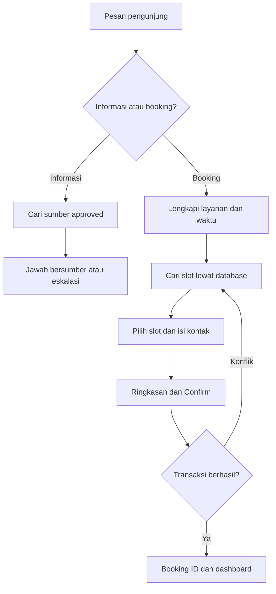
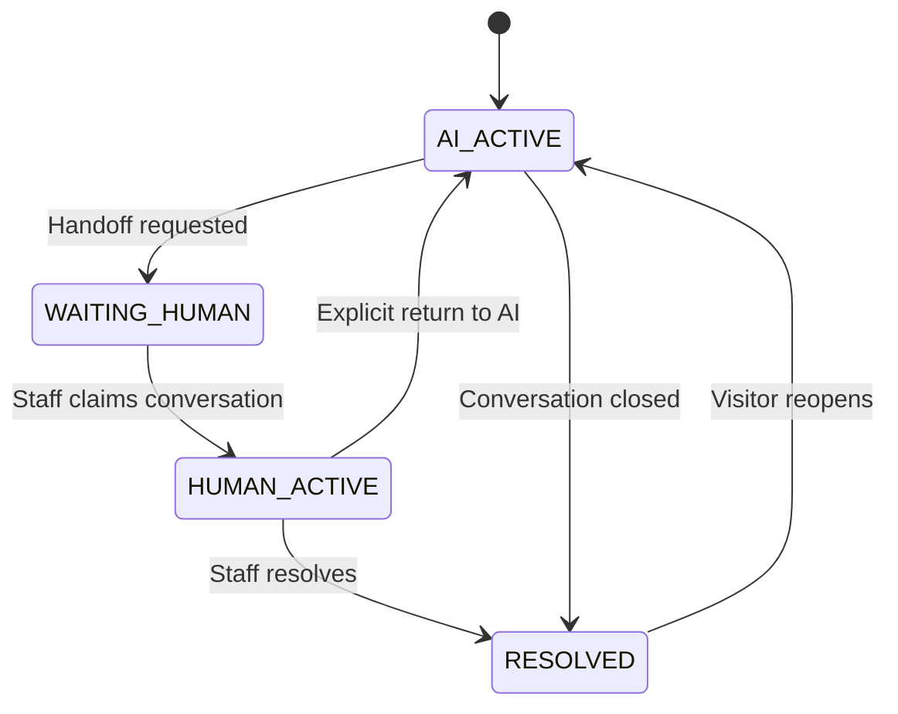
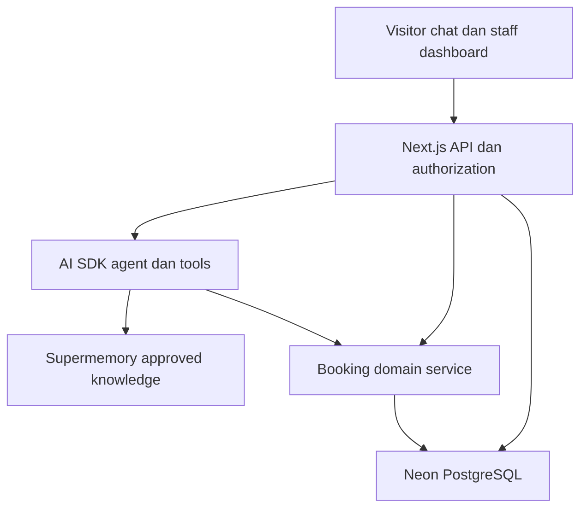

# Product Requirements Document
# AI Clinic Front Desk — MVP v1.0

**Tanggal:** 2 Oktober 2026  
**Status:** Siap menjadi dasar breakdown implementasi; belum diimplementasikan atau divalidasi pengguna pilot.  
**Pemilik produk:** Core Solution  
**Stack wajib:** TypeScript, Next.js App Router, Vercel AI SDK, Supermemory, PostgreSQL/Neon, Vercel.  
**Format:** PRD produk dengan kontrak teknis minimum. Struktur modul adalah rekomendasi; detail implementasi dapat disesuaikan selama acceptance criteria tetap dipenuhi.

## 1. Ringkasan eksekutif

AI Clinic Front Desk membantu calon pasien mencari informasi administratif, melihat ketersediaan, membuat atau mengubah appointment, dan meminta bantuan resepsionis melalui percakapan. Dashboard membantu staf menangani percakapan serta jadwal yang sama.

MVP membuktikan satu alur bisnis lengkap: **pertanyaan → informasi dari sumber → pencarian slot → konfirmasi pengguna → transaksi booking → appointment terlihat pada dashboard → perubahan/pembatalan yang aman**.

Produk ini adalah resepsionis administratif. Ia tidak menentukan diagnosis, rekomendasi terapi, atau kelayakan klinis. Informasi yang belum tersedia dan pertanyaan di luar cakupan diteruskan kepada staf.

Keputusan utama: model memahami percakapan dan menggunakan tools; kode memvalidasi aturan; PostgreSQL menentukan keberhasilan transaksi. Supermemory digunakan untuk knowledge retrieval, bukan sumber kebenaran jadwal atau data appointment.

## 2. Dasar kebutuhan dan tingkat kepastian

Sumber pembeli: [Upwork — AI Front Desk for Wellness Clinics](https://www.upwork.com/freelance-jobs/apply/Front-Desk-for-Wellness-Clinics-SaaS-B2B_~022102346186946908149/).

Postingan menyebut klinik wellness/aesthetics di UAE, percakapan AI, integrasi WhatsApp/SMS, appointment booking, dan dashboard. Pengalaman voice serta keamanan data menjadi nilai tambah. Detail scope akan dibahas dengan kandidat.

PRD ini memperinci kebutuhan tersebut menjadi proyek portofolio independen. Aturan booking, struktur data, jumlah layanan, bahasa, KPI, dan pembagian tahap merupakan keputusan desain kita; bukan persyaratan pembeli yang telah dikonfirmasi. Implementasi web chat saja tidak boleh dipresentasikan sebagai telah memenuhi integrasi WhatsApp/SMS asli.

## 3. Masalah, tujuan, dan indikator manfaat

### Masalah yang ingin diselesaikan

- Pengunjung harus menunggu staf untuk pertanyaan berulang dan pilihan jadwal.
- Informasi appointment tersebar dalam percakapan dan sulit ditindaklanjuti.
- Staf harus memeriksa ketersediaan dan mengetik konfirmasi berulang.
- Booking melalui percakapan dapat salah tanggal, tidak tersimpan, atau berbenturan jika tidak memiliki kontrol transaksi.

### Tujuan MVP

1. Pengunjung dapat menyelesaikan booking administratif tanpa bantuan staf ketika informasi lengkap dan slot tersedia.
2. Staf dapat melihat appointment dan mengambil alih percakapan tanpa kehilangan konteks.
3. Semua tindakan penting memiliki status yang benar, hak akses, dan audit yang dapat ditelusuri.
4. Demo publik menunjukkan hasil sungguhan pada database, dengan seluruh data pasien bersifat sintetis.

### Metrik produk setelah pilot

| Metrik | Definisi | Penggunaan |
|---|---|---|
| Booking completion | Sesi yang menghasilkan booking confirmed / sesi yang memulai pencarian slot; tampilkan juga penyebab gagal | Menilai hambatan proses; bukan bukti tambahan revenue |
| Waktu aktif admin per booking | Waktu staf membaca, mengoreksi dan mengonfirmasi booking; bandingkan kasus setara sebelum/sesudah | Mengukur beban kerja, termasuk pemulihan error |
| Waktu respons manusia | Balasan staf pertama dikurangi waktu handoff_requested | Menilai antrean dan kecukupan staf; tampilkan di dalam/luar jam operasional |

Belum ada baseline nyata. Jangan menetapkan klaim penghematan atau no-show reduction sebelum mengukurnya. Target teknis pengujian berada di bagian 19.

## 4. Persona dan hak akses

| Peran | Tujuan | Akses MVP |
|---|---|---|
| Pengunjung | Informasi, booking, reschedule/cancel, kontak staf | Percakapan dan booking milik sesi terautentikasi pengunjung sendiri |
| Resepsionis | Mengelola inbox dan appointment | Percakapan klinik, kontak administratif, perubahan appointment, check-in/status |
| Admin klinik | Mengatur operasional | Semua akses resepsionis, konfigurasi layanan/jadwal/knowledge dan akun staf |

MVP mempunyai guest session yang aman untuk browser pengunjung dan login untuk staf. Mengetik nama, nomor telepon, email, atau booking ID **tidak** membuktikan kepemilikan. Akses booking ditautkan ke guest session server-side. Jika sesi hilang atau pindah perangkat, pengguna diarahkan ke staf; verifikasi OTP/magic link menjadi fitur lanjutan.

Percakapan dan data internal tidak masuk endpoint publik. Admin demo yang dibagikan untuk portofolio hanya mengakses lingkungan sintetis yang terisolasi dari data operasional.

## 5. Scope dan urutan release

### P0 — MVP inti, wajib sebelum rilis portofolio

- Satu klinik, satu cabang, satu timezone klinik.
- Tiga layanan, dua provider/tenaga layanan, kapasitas satu appointment per provider pada satu waktu.
- Web chat, streaming, histori, sumber jawaban, dan action cards booking.
- Knowledge base administratif yang disetujui; input teks/Markdown.
- Jadwal mingguan provider, time-off/pengecualian tanggal, durasi dan buffer layanan.
- Booking, reschedule, cancel, status appointment dan audit.
- Human handoff, inbox staf, assignment dan balasan web chat.
- Dashboard kalender/list, layanan, provider, jadwal dan knowledge.
- Demo dua browser, seed sintetis, evaluasi dan dokumentasi deployment.

### P1 — Integrasi kanal, release terpisah

- Satu koneksi WhatsApp sungguhan melalui provider resmi.
- Webhook inbound/status, outbound messages, deduplikasi, verifikasi signature, pengelolaan template/consent sesuai provider.
- Verifikasi identitas kanal sebelum akses appointment lintas sesi.
- SMS, reminder terjadwal dan external calendar hanya setelah kebutuhan/biaya disepakati.

### Tidak termasuk v1

Voice agent, pembayaran/deposit, asuransi, EMR/rekam medis, clinical triage, resep, multi-klinik SaaS, multi-provider appointment, kapasitas kelompok, ruang/peralatan bersama, Google Calendar sync, OCR, attachment pasien, recurring booking, kampanye marketing, dan klaim compliance siap produksi.

Web chat merupakan kanal nyata yang didukung P0. Halaman simulator webhook harus dilabeli simulation; ia tidak memenuhi acceptance integrasi WhatsApp.

## 6. Konfigurasi default dan aturan operasional

Default demo: klinik fiktif **WellNest Clinic**, timezone `Asia/Dubai`, currency AED, UI bahasa Inggris. Ini mengikuti konteks UAE dari postingan. Semua pengaturan disimpan di database; adaptasi klinik Indonesia dapat memakai `Asia/Jakarta` atau timezone cabang. Jangan hardcode harga/hari buka di prompt.

| Aturan | Default desain v1 |
|---|---|
| Jadwal appointment | Kelipatan 15 menit; seluruh durasi dan buffer demo kelipatan 15 menit |
| Booking horizon | 30 hari ke depan |
| Minimum notice | 2 jam sebelum appointment |
| Reschedule/cancel sendiri | Sampai 2 jam sebelum mulai; setelah itu minta staf |
| Konfirmasi tindakan | Ringkasan + tombol Confirm; action pending berlaku 5 menit |
| Slot sementara | Tidak di-hold; ketersediaan dicek ulang saat Confirm |
| Jenis layanan | Fixed duration, fixed price; tidak ada harga hasil tebakan model |
| Kapasitas | Satu appointment aktif per provider dalam rentang terpakai |
| Resource | Provider saja; ruang bersama belum didukung |

Rentang terpakai adalah start sampai end + buffer sesudah layanan. Gunakan interval setengah terbuka `[start, occupied_end)` agar booking berikutnya tepat di akhir buffer diizinkan. Durasi, harga, nama layanan dan buffer disimpan sebagai snapshot appointment untuk menjaga histori.

Slot valid harus berada sepenuhnya dalam jam kerja dan jam buka, termasuk buffer, tidak menabrak time-off atau appointment aktif, memenuhi notice/horizon, serta menggunakan provider yang mendukung layanan. Jadwal yang ditampilkan adalah penawaran, bukan reservasi.

Tanggal relatif seperti “Jumat depan” ditafsirkan dengan timezone klinik; jika ambigu, tanyakan. Konfirmasi selalu menampilkan tanggal kalender lengkap, jam dan timezone. Simpan instan di UTC serta timezone IANA klinik. Uji timezone yang memiliki DST meskipun demo Dubai tidak menggunakannya.

Perubahan jam kerja/time-off yang berbenturan dengan appointment confirmed ditolak dan menampilkan konflik; staf harus menangani appointment terkait secara eksplisit. Menonaktifkan provider/layanan mencegah booking baru tetapi tidak menghapus appointment lama.

## 7. Journey A — Bertanya dan membuat appointment

1. Backend menyimpan pesan pengguna secara idempotent dan membaca status percakapan.
2. AI mengenali intent. Untuk informasi operasional, baca layanan/config atau knowledge approved. Untuk booking, kumpulkan service dan waktu; provider boleh dipilih otomatis berdasarkan slot yang disetujui pengguna.
3. Tool availability menghasilkan kandidat nyata dengan provider, waktu, timezone, durasi, harga dan versi konfigurasi.
4. Pengunjung memilih slot, memasukkan nama dan satu kontak administratif. Untuk demo, tampilkan bahwa data fiktif yang digunakan.
5. Server membuat pending action dengan payload berversi dan hash. UI menampilkan ringkasan. Pengguna menekan Confirm. Model tidak dapat mengonfirmasi atas nama pengguna.
6. Server memvalidasi session, kepemilikan, payload, expiry, aturan terkini dan availability. Jalankan transaksi singkat untuk menyimpan appointment, audit dan hasil idempotency.
7. Setelah commit, render kartu sukses berdasarkan hasil tool, bukan teks bebas model: booking reference, layanan, provider, tanggal/jam dan status.
8. Dashboard staf membaca appointment yang sama. Kegagalan notifikasi tidak membatalkan booking yang sudah commit.

Jika tidak tersedia slot, tawarkan tanggal/provider alternatif atau handoff; jangan membuat appointment tentative seolah sudah confirmed.

## 8. Journey B — Reschedule dan cancel

1. Pengunjung membuka booking yang ditautkan pada sesi miliknya. Backend memvalidasi akses dan status.
2. Reschedule mencari slot baru; cancel menampilkan konsekuensi dan kebijakan yang berlaku.
3. Buat pending action baru dengan appointment ID, expected version dan payload baru; minta Confirm.
4. Reschedule memperbarui booking **dalam satu transaksi**. Jika slot baru gagal, appointment lama tetap utuh. Simpan before/after pada audit dan naikkan version.
5. Cancel mengubah status ke CANCELLED, tidak menghapus histori; slot dibebaskan ketika commit berhasil.
6. UI menampilkan state final dari backend. Jika appointment sudah diubah oleh staf, balas `VERSION_CONFLICT` dan minta pengguna membaca ringkasan terbaru.

Sesudah batas perubahan mandiri, hanya staf yang bisa override dengan alasan tercatat. Override tetap tidak boleh membuat overlap. Appointment cancelled, completed atau no-show tidak dapat direschedule menjadi confirmed; buat booking baru bila diperlukan.

## 9. Journey C — Human handoff

Pengunjung dapat meminta staf kapan saja. Eskalasi juga dilakukan untuk sumber tidak cukup, kegagalan berulang, kebutuhan di luar scope atau kebijakan yang membutuhkan staf.

Handoff menyimpan alasan, ringkasan, histori, pending action dan ticket. Jika staf offline, simpan permintaan kontak tanpa menjanjikan waktu balasan yang belum ditetapkan. Inbox dashboard menampilkan unread/waiting; tidak ada email/SMS otomatis dalam P0.

Claim dilakukan atomik agar dua staf tidak mengambil percakapan bersamaan. AI berhenti dalam WAITING_HUMAN/HUMAN_ACTIVE. Pending action dari AI dibatalkan saat takeover. Tool mutasi dan persist final output memeriksa status/version lagi; output model yang selesai terlambat dibuang.

Action yang sudah commit sebelum handoff tetap valid dan terlihat pada histori. Handoff tidak boleh menciptakan kesan booking yang sudah tersimpan hilang. Lock/status version menentukan urutan race ini.

## 10. Status appointment dan pengiriman

| Status appointment | Masuk melalui | Transisi yang diizinkan |
|---|---|---|
| CONFIRMED | Create commit berhasil | CHECKED_IN, CANCELLED, NO_SHOW |
| CHECKED_IN | Staf, saat kedatangan | COMPLETED; koreksi oleh admin dengan audit |
| COMPLETED | Staf | Terminal; perubahan administratif hanya melalui koreksi terkontrol |
| CANCELLED | Pengunjung berizin atau staf | Terminal; booking baru bila ingin kembali |
| NO_SHOW | Staf setelah waktu appointment berlalu | Terminal; koreksi admin dengan audit |

P0 tidak memiliki PENDING appointment: ketidaklengkapan ditaruh di conversation/pending action. Reschedule adalah perubahan waktu pada appointment confirmed dengan audit, bukan status permanen RESCHEDULED.

Appointment aktif untuk konflik kapasitas: CONFIRMED dan CHECKED_IN. Status completed/no-show hanya dapat ditetapkan pada waktu yang sesuai; jangan menggunakannya untuk membebaskan slot masa depan secara tidak sah.

Delivery status berbeda: NOT_REQUESTED, QUEUED, SENT, FAILED, UNKNOWN. Web UI berhasil menampilkan kartu bukan bukti pesan WhatsApp diterima. Untuk P1, status provider dan retry dicatat terpisah; kegagalan pengiriman tidak membatalkan booking.

## 11. Functional requirements dan acceptance criteria

P0 berarti release blocker. P1 berarti fitur lanjutan yang tidak menghalangi P0.

| ID | Prioritas | Requirement | Acceptance yang dapat diuji |
|---|---|---|---|
| FR-01 | P0 | Session pengunjung dan login staf | Sesi A tidak dapat membaca/mengubah data sesi B; staf memiliki RBAC server-side |
| FR-02 | P0 | Chat persist/stream | Pesan tetap ada setelah reload; retry request ID sama tidak menambah duplikat |
| FR-03 | P0 | Knowledge approved | Sumber draft/disabled tidak dipakai; citation menunjuk versi/sumber yang benar |
| FR-04 | P0 | Abstain/handoff | Pertanyaan tanpa sumber tidak mendapatkan kebijakan/layanan hasil karangan |
| FR-05 | P0 | Availability | Slot di luar kerja, time-off, buffer, notice dan horizon tidak ditawarkan |
| FR-06 | P0 | Booking confirm | Hanya payload yang dikonfirmasi dan belum expired boleh dieksekusi |
| FR-07 | P0 | Konflik atomik | Dua request bersamaan untuk interval overlap hanya mengizinkan satu appointment |
| FR-08 | P0 | Reschedule atomik | Gagal pindah mempertahankan waktu lama; berhasil pindah hanya memakai slot baru |
| FR-09 | P0 | Cancel | Unauthorized ditolak; authorized cancel membebaskan interval dan menyimpan audit |
| FR-10 | P0 | Human takeover | Claim eksklusif; AI tidak mengirim jawaban/tindakan baru sesudah takeover |
| FR-11 | P0 | Inbox | Staf membaca histori, membalas, assign, resolve; internal notes tidak bocor ke visitor |
| FR-12 | P0 | Appointment dashboard | Calendar/list/filter membaca record booking nyata; staf dapat mengubah status sesuai aturan |
| FR-13 | P0 | Operasional | Config dan perubahan jadwal tervalidasi; konflik dengan booking muncul sebelum simpan |
| FR-14 | P0 | Knowledge lifecycle | Approve/index/status/retry/update/disable bekerja; disabled langsung dikeluarkan dari retrieval |
| FR-15 | P0 | Demo | Alur dua sesi browser berhasil dan data sintetis dilabeli jelas |
| FR-16 | P0 | Reliability | DB/LLM/retrieval error tidak berubah menjadi konfirmasi booking palsu |
| FR-17 | P1 | WhatsApp inbound/outbound | Pesan sungguhan masuk, jawaban terkirim, status provider tercatat, duplikat webhook aman |
| FR-18 | P1 | Reminder | Jadwal persistent, consent/provider rules, delivery tracking; trigger simulasi dilabeli |

## 12. Halaman dan pengalaman antarmuka

| Route rekomendasi | Pengguna | Isi |
|---|---|---|
| `/` | Publik | Profil klinik demo, layanan, jam buka, CTA chat/book |
| `/chat` | Pengunjung | Percakapan, citation panel, slot cards, confirm cards, handoff |
| `/my-appointments` | Pengunjung | Booking milik session, detail, reschedule/cancel |
| `/staff/login` | Staf | Login dan pesan akses |
| `/dashboard` | Staf | Ringkasan hari ini, waiting conversations, appointments |
| `/dashboard/inbox` | Staf | Filter, conversation pane, reply, notes, assignment |
| `/dashboard/appointments` | Staf | Calendar/list, detail, status dan perubahan |
| `/dashboard/services` | Admin | Layanan, harga, durasi, buffer, provider eligibility |
| `/dashboard/schedules` | Admin | Jadwal provider, time-off, conflict preview |
| `/dashboard/knowledge` | Admin | Dokumen/versi/approval/indexing/retry |
| `/dashboard/settings` | Admin | Timezone, currency, notice/horizon, jam buka, booking policy |
| `/demo` | Reviewer portofolio | Skenario uji terpandu dan link dua peran, tanpa secret |

UI harus menampilkan pending/success/error/empty/offline secara nyata, dapat dioperasikan keyboard, label field jelas, dan responsive. Informasi action tidak hanya muncul sebagai kalimat chat: slot, harga, timezone dan status tampil pada kartu terstruktur. Jangan menampilkan patient contact/notes pada public demo yang tidak memiliki otorisasi.

## 13. Arsitektur aplikasi

### Tanggung jawab stack

- **Next.js:** halaman, server API, authentication integration, validasi request dan rendering action cards.
- **Vercel AI SDK:** ToolLoopAgent, streaming dan tool calling; gunakan API yang sesuai versi terpasang. Model dapat dikonfigurasi melalui AI Gateway default atau provider yang dipilih pemilik.
- **Supermemory:** indexing dan retrieval dokumen administratif approved. Gunakan adapter agar versi SDK/API tidak tersebar di seluruh modul.
- **Neon/PostgreSQL:** sumber kebenaran domain; session, chat, appointment, jadwal, versi, approval action, idempotency dan audit.
- **Vercel:** deploy serverless. P0 menggunakan polling ringan untuk balasan staf, tanpa server WebSocket permanen. Streaming model per request berbeda dari polling inbox.

Gunakan Node runtime dan driver PostgreSQL yang mendukung transaksi yang dibutuhkan. Pilihan awal: Drizzle ORM dengan migrations SQL dan driver Neon/pg kompatibel transaksi. Ini tambahan implementasi, bukan perubahan stack wajib. Periksa extension/driver pada deployment sebelum menetapkan strategi lock.

Tidak ada transaksi database yang dibiarkan terbuka selama model inference atau panggilan Supermemory. Semua side effect melewati domain service yang sama, baik dipanggil chat, endpoint publik maupun dashboard staf.

### Mapping modul ke codebase

| Modul rekomendasi | Pemilik tanggung jawab | Larangan dependensi |
|---|---|---|
| `modules/auth` | Guest/staff sessions dan authorization | Jangan mempercayai role/clinic ID dari browser |
| `modules/clinic` | Settings, services, provider eligibility | Jangan menggantungkan config pada prompt |
| `modules/scheduling` | Availability, shifts, time-off, timezone | Tidak memanggil LLM untuk keputusan slot |
| `modules/appointments` | Create/reschedule/cancel/status/idempotency | Semua jalur mutation harus menggunakan service ini |
| `modules/conversations` | Pesan, status, assignment, handoff | Internal notes tidak masuk serializer visitor |
| `modules/knowledge` | Versions, approval, indexing, retrieval filter | Tidak mengindeks data pasien/chat secara otomatis |
| `modules/ai` | Agent, prompt, tool definitions, evidence | Tidak menulis appointment langsung melalui ORM |
| `modules/channels` | Web adapter; WhatsApp adapter P1 | Tidak memindahkan aturan booking ke adapter kanal |
| `modules/audit` | Events, correlation, observability | Tidak mencatat secret/full clinical text |
| `db` | Schema, migrations, seed | Schema changes harus versioned |

## 14. Model data minimum

Seluruh entitas scoped dengan `clinic_id` meskipun v1 single-clinic. UUID untuk ID internal; booking reference publik berbeda dan tidak dipakai sebagai credential. Semua timestamp berzona disimpan sebagai `timestamptz`.

| Entitas | Field penting | Invariant |
|---|---|---|
| clinics | name, timezone, currency, policy, version | Satu clinic demo; settings versioned |
| staff_users | auth_subject, clinic_id, role, active | Role diperiksa server-side |
| guest_sessions | token_hash, expires_at, clinic_id | Cookie/token opaque; revocable dan tidak dipublikasikan |
| visitors | guest_session_id, display_name, contact, consent_at | Kontak minimum; bukan rekam medis |
| services | name, duration, buffer, price_minor, active, version | Harga integer minor units; provider eligible |
| providers | display_name, active | Histori tetap saat inactive |
| provider_services | provider_id, service_id | Unique pasangan |
| working_hours | provider_id, weekday, local_start/end | Interval tidak saling overlap; jam klinik juga dipenuhi |
| schedule_exceptions | provider_id, start/end, reason, version | Time-off interval; write diserialisasi terhadap booking |
| conversations | visitor_id, status, assigned_staff_id, version | Claim/takeover atomik |
| messages | conversation_id, role, content, parts, client_message_id, status | Unique request ID per conversation; pesan tool terstruktur |
| internal_notes | conversation_id, author, content | Tidak ikut response visitor |
| handoff_tickets | conversation_id, reason, status, created_at | Maksimal satu ticket open per conversation |
| pending_actions | type, session_id, conversation_id, payload_hash, payload, expires_at, status | Versi immutable; consumption sekali; validasi identity saat execute |
| appointments | visitor_id, service/provider_id, start/end, occupied_end, status, version, snapshots | Rentang aktif provider tidak overlap |
| idempotency_records | actor_scope, key, request_hash, result, status | Unique scope+key; payload berbeda key sama ditolak |
| knowledge_documents | title, active_version_id, visibility, active | Filter authoritative dari Neon |
| knowledge_versions | content, hash, approval_status, indexing_status, remote_id, source_label | Versi ready+approved sebelum aktif |
| audit_events | actor, action, entity_id, before/after minimal, request_id, timestamp | Atomic dengan booking mutations |
| channel_events | provider, event_id, delivery_state, appointment/message_id | P1; unique provider+event_id |

Indeks minimum: provider + start/end appointment, conversation + created_at messages, assigned_staff + status, knowledge remote ID/version, session expiry, idempotency unique key. Jangan menyimpan patient data sebagai memory retrieval yang dapat diakses publik.

## 15. Transaksi, concurrency, dan konfirmasi tindakan

### Mutasi appointment

1. Autentikasi aktor dan validasi pending action/expected appointment version.
2. Gunakan idempotency key. Request payload yang sama mengembalikan hasil yang sama; payload berbeda dengan key sama ditolak.
3. Kunci resource provider pada transaksi singkat. Semua writer appointment **dan jadwal/time-off** memakai aturan lock yang sama. Jika melibatkan dua provider saat reschedule, lock dalam urutan ID tetap untuk mencegah deadlock.
4. Baca config/jadwal/konflik terkini. Terapkan batas kebijakan; admin override memerlukan alasan dan tetap tunduk pada konflik kapasitas.
5. Create/update appointment, consume action, write audit dan idempotency result dalam commit yang sama.
6. Kembalikan hasil domain terstruktur; render sukses setelah commit.

Gunakan PostgreSQL exclusion constraint pada provider + rentang occupied aktif sebagai pertahanan tambahan jika extension yang diperlukan tersedia. Jika tidak tersedia, documentasikan strategi lock provider yang digunakan dan buktikan semua jalur writer serta concurrency tests; unique start_time saja tidak cukup mencegah overlap durasi.

### Konfirmasi yang tidak dapat dipalsukan model

Model dapat meminta server membuat pending action. Hanya endpoint Confirm dari sesi berizin yang dapat mengonsumsinya. Payload terikat pada actor, conversation, action type, snapshot/version dan expiry. Perubahan pilihan membatalkan action lama. Setelah handoff, pending action AI tidak lagi valid.

P0 menggunakan tombol Confirm, bukan parsing “iya” sebagai approval otomatis. P1 dapat mendukung teks konfirmasi dengan protokol kanal khusus yang memverifikasi sender dan mengikat jawaban pada satu action aktif.

### Outcome ambigu

Jika client timeout sesudah commit, retry dengan key yang sama membaca hasil tersimpan. UI boleh meminta refresh/status, tetapi tidak menjalankan booking baru dengan key berbeda secara otomatis. LLM/retrieval failure tidak mengubah record confirmed. Cancellation/reschedule tidak boleh hanya mengubah teks chat.

## 16. API dan kontrak tool

Nama route dapat berubah; perilaku dan izin tidak boleh berubah.

| Endpoint | Fungsi | Akses |
|---|---|---|
| POST `/api/guest-session` | Membuat sesi visitor | Rate limited; server menetapkan scope |
| POST `/api/chat` | Simpan pesan dan stream respons | Guest owner; cek status conversation |
| GET `/api/conversations/:id/messages` | Histori/polling | Owner atau staf klinik; serializer berbeda |
| GET `/api/availability` | Slot publik | Tidak mengembalikan detail appointment/pasien |
| POST `/api/actions/:id/confirm` | Execute pending action | Owner/staf berizin, idempotency key |
| GET `/api/my-appointments` | Daftar booking sesi sendiri | Guest session |
| POST `/api/staff/conversations/:id/claim` | Claim/handoff | Staf; expected version |
| POST `/api/staff/conversations/:id/reply` | Balasan manusia | Staf assigned/admin |
| PATCH `/api/staff/appointments/:id` | Status/perubahan administratif | Role/policy/expected version |
| CRUD `/api/admin/services`, `/schedules`, `/knowledge` | Konfigurasi dan konten | Admin |
| POST `/api/admin/knowledge/:id/reconcile` | Update indexing state/retry | Admin; bounded work, persistent status |
| POST `/api/webhooks/whatsapp` | Pesan/event provider | P1; signature verified, replay dedupe |

Tool read: `searchClinicKnowledge`, `getClinicServices`, `getAvailableSlots`, `getOwnedAppointments`. Tool action: `prepareBooking`, `prepareReschedule`, `prepareCancellation`, `requestHumanHandoff`. Fungsi domain `createAppointment`, `rescheduleAppointment`, `cancelAppointment` dipanggil executor konfirmasi, bukan tool bebas tanpa approval.

Response domain minimal: `success`, `code`, `requestId`, `data`, `retryable`. Codes: VALIDATION_ERROR, UNAUTHORIZED, FORBIDDEN, SLOT_UNAVAILABLE, ACTION_EXPIRED, VERSION_CONFLICT, POLICY_REQUIRES_STAFF, SERVICE_UNAVAILABLE, RATE_LIMITED, UNKNOWN_COMMIT_STATUS. Tidak mengekspos SQL, token atau stack trace kepada visitor.

## 17. Knowledge dan perilaku AI

Dokumen awal: profil klinik, lokasi, jam buka, layanan, harga yang merujuk config, cara booking, persiapan administratif, kebijakan cancel/reschedule, kontak staf. Harga/durasi/jadwal dari database menang atas dokumen naratif. Konflik policy meminta review admin; jangan memilih sumber secara acak.

Lifecycle: DRAFT → APPROVED → INDEXING → READY; FAILED dapat retry; DISABLED tidak dapat digunakan. Admin mengedit menjadi versi baru; versi lama tetap aktif sampai versi baru approved+ready bila tidak dinonaktifkan secara eksplisit. Source deletion/disable mengubah filter Neon segera, kemudian remote cleanup dengan status persistent.

Retrieval wajib scope server-side, mencocokkan remote result dengan active approved version di Neon, dan memakai sumber public-safe. Tampilkan source title, versi dan excerpt; jangan membuat link remote private yang dapat dibuka sembarang orang. Unverified source IDs dibuang. Tidak otomatis memanggil Supermemory add-memory pada chat pasien.

AI harus abstain saat tidak punya sumber, meminta klarifikasi untuk tanggal/layanan ambigu, dan tidak menjamin hasil medis. Pertanyaan klinis diarahkan ke staf sesuai approved clinic policy; tidak ada diagnosis/triage generatif. Batasi langkah tool awal ke enam per turn dan jumlah output/context; nilai ini diuji dan dapat disesuaikan lewat config.

Jika retrieval gagal, beri pesan kegagalan dan handoff; pembacaan jadwal terstruktur masih dapat bekerja tanpa Supermemory jika pengguna telah memilih layanan valid. Jika model gagal, sediakan form booking manual yang memanggil domain service yang sama.

## 18. Non-functional requirements dan operasional

- **Security:** server-side RBAC/ownership, HttpOnly secure sessions, CSRF protection untuk cookie-auth mutations, input limits, persistent rate limits dan secrets server-only. Public demo tidak memberi admin operasional terbuka.
- **Privacy:** data minimum administratif; data demo sintetis. Jangan meminta diagnosis, hasil lab atau riwayat medis. Retention default demo 30 hari untuk kontak/pesan; anonymize sesuai policy sambil mempertahankan statistik nonidentifying. Penggunaan data nyata membutuhkan penilaian akses, provider dan kewajiban lokal tersendiri.
- **Reliability:** migrations/backup procedure, error codes, bounded retry, idempotency, persistent state dan concurrency tests. No fake successful provider integrations.
- **Performance targets sementara:** availability p95 ≤2 detik; booking mutation p95 ≤3 detik; AI first visible response p95 ≤5 detik. Ukur pada Vercel/Neon region yang dipakai, laporkan cold/warm dan kegagalan. Bukan SLA produksi.
- **Polling:** interval awal 5 detik saat aktif, pause ketika tab tersembunyi, backoff saat error. Paginated incremental queries; jangan fetch seluruh histori setiap poll.
- **Accessibility:** keyboard navigation, labels, focus, status announcements, contrast memadai dan responsive; klaim formal accessibility compliance memerlukan audit tersendiri.
- **Observability:** correlation ID menghubungkan pesan, tool, transaction dan audit; log durasi/error/model usage tanpa secret atau full patient content.
- **Cost:** SDK bukan model gratis. Catat model/tokens/request count; budget ceiling configurable dan matikan inference demo jika batas terlampaui. Verifikasi tarif/kuota saat setup, jangan membeli upgrade otomatis.
- **Deployment:** dev/preview/production memakai env dan database scope terpisah. Tidak menggunakan local filesystem Vercel sebagai penyimpanan durable. Indexing reconcile dipicu admin dengan job status persistent; jangan mengandalkan background tak terpantau sesudah HTTP response.

Reminder scheduler dan delivery worker belum dibutuhkan P0. Jika ditambahkan P1, definisikan mekanisme durable trigger/retry yang cocok dengan paket hosting; tombol “simulate reminder” bukan reminder otomatis produksi.

## 19. Acceptance testing dan quality gates

### Dataset

Seed satu klinik, tiga layanan durasi/harga bervariasi, dua provider, tujuh hari aturan kerja, time-off, dan 15 knowledge documents sintetis. Tanggal seed relatif terhadap tanggal eksekusi, agar demo tidak menjadi jadwal masa lalu.

Evaluasi AI: 40 kasus berlabel — 15 FAQ answerable, 10 pertanyaan tanpa sumber/di luar administratif, 10 booking/date ambiguity, 5 prompt injection. Gunakan 25 development dan 15 holdout; label ditetapkan sebelum penilaian. Target awal answerable ≥90% benar+supported dan unanswerable ≥90% abstain/handoff, dengan numerator/denominator dan kegagalan dilaporkan. Nilai booking correctness melalui hasil domain, bukan keramahan teks.

### Tes wajib

| ID | Kasus | Expected result |
|---|---|---|
| AT-01 | FAQ approved | Jawaban sesuai sumber aktif, citation valid |
| AT-02 | Pertanyaan tidak tersedia | Tidak mengarang; handoff tersedia |
| AT-03 | Dokumen disabled/versi lama | Tidak dipakai meski hasil remote masih muncul |
| AT-04 | Prompt injection dalam dokumen/chat | Tidak mengubah scope/izin atau membuka data internal |
| AT-05 | Layanan/date ambigu | Klarifikasi sebelum preparing action |
| AT-06 | Klik Confirm valid | Satu appointment, satu audit mutation, booking ID |
| AT-07 | Action expired/berubah payload | Tidak melakukan mutation; minta ringkasan baru |
| AT-08 | Dua request overlap bersamaan | Tepat satu sukses; lainnya SLOT_UNAVAILABLE |
| AT-09 | Durasi/buffer/time-off/jam buka | Slot konflik tidak ditawarkan atau berhasil dibook |
| AT-10 | Retry key sama setelah timeout | Mengembalikan hasil semula; tidak ada duplicate |
| AT-11 | Reschedule conflict | Booking lama utuh; tidak ada partial update |
| AT-12 | Reschedule sukses | Version bertambah, audit old/new; slot lama tersedia |
| AT-13 | Cancel berizin/tidak berizin | Berizin membebaskan slot; tidak berizin tidak berubah |
| AT-14 | Sesi lain menebak booking ID | Tidak melihat/mengubah detail |
| AT-15 | Dua staf claim bersamaan | Satu assigned; lawan menerima version/claim conflict |
| AT-16 | Takeover ketika model berjalan | Late output/tool ditolak; tidak ada double reply |
| AT-17 | Ubah schedule sambil booking | Konflik terkontrol, tidak tercipta invalid appointment |
| AT-18 | Policy batas waktu/version change | Visitor diarahkan staf atau re-confirm sesuai latest state |
| AT-19 | DB/model/Supermemory timeout | Error jujur; tidak ada konfirmasi sukses palsu |
| AT-20 | Dua sesi browser + reload | Balasan staf/booking persist dan terlihat tepat |
| AT-21 | Ubah timezone/DST/date relative | UTC/local benar dan konfirmasi tidak ambigu |
| AT-22 | Internal notes/config endpoints | Tidak bocor visitor; unauthorized writes ditolak |

Concurrency gate: jalankan setidaknya 20 request bersamaan untuk interval provider sama pada database uji, hasil satu booking confirmed. Ulangi dengan durasi overlap, retry, dan reschedule, bukan hanya start time identik. Target nol overlap dan nol unauthorized mutation pada fixture wajib; ini bukan klaim absolut di luar cakupan pengujian.

### Definition of Done release P0

Semua FR P0/AT wajib lolos; lint/typecheck/build dan test suite lulus. UI desktop/mobile ditinjau. Alur di Vercel diuji dengan database dan Supermemory sungguhan; mock hanya untuk unit tests/failure injection. Ada README setup, .env.example tanpa secrets, migration/seed, backup/recovery, evaluasi aktual dan known limitations. Tidak ada blocker keselamatan transaksi, data leakage, atau fitur inti yang hanya berupa tombol kosong.

## 20. Backlog yang dapat dipecah ke codebase

| Epic | Deliverable | Dependensi | Syarat selesai |
|---|---|---|---|
| E0 Foundation | Next app, database, migrations, env validation, staff/guest auth | Akses deployment/database | Login/scope/test connection nyata |
| E1 Clinic configuration | Service/provider/settings/schedules UI dan APIs | E0 | Seed, validation, admin permissions |
| E2 Booking domain | Availability, pending actions, locks, idempotency, audit | E1 | AT-06–14/17/18/21 lulus tanpa AI |
| E3 Knowledge | Versioning, approve/index/reconcile, retrieval adapter | E0 | Ready state/update/disable nyata |
| E4 Chat agent | AI SDK streaming/tools/citations/booking cards | E2,E3 | Informasi + booking end-to-end |
| E5 Human desk | Inbox, assignment, takeover, reply, notes | E0,E4 | Dua browser dan race tests lulus |
| E6 Demo + QA | Scenario runner, evaluation, responsive, failure cases | E2–E5 | Quality gates dan laporan hasil |
| E7 Deploy + handover | Vercel URL, production migrations, docs/video | E6 | Alur utama dan auth diuji pada URL |
| E8 WhatsApp P1 | Adapter/signature/events/delivery/identity | P0 + kredensial/biaya disepakati | Pesan provider sungguhan diuji |

Untuk setiap task implementasi, tulis: ID FR/AT terkait, input/output, izin, perubahan schema, failure modes, serta evidence selesai. Hindari membagi seluruh frontend dulu dan backend belakangan. Kerjakan vertical slice: satu alur dengan database dan UI yang benar-benar berjalan.

## 21. Demo portofolio dan bukti hasil

Demo 5–7 menit:

1. Pengunjung meminta harga layanan; AI menunjukkan sumber/config yang benar.
2. Pengunjung memilih slot dan Confirm; kartu booking serta dashboard menunjukkan appointment yang sama.
3. Pengunjung lain mencoba slot overlap; sistem menawarkan alternatif.
4. Pengunjung reschedule; dashboard berubah dan histori mencatat perubahan.
5. Pengunjung meminta staf; staf claim dan membalas dari browser berbeda.
6. Tunjukkan satu pertanyaan tanpa sumber, audit event dan laporan tes.

UI demo menampilkan tahapan yang bisa dipahami: Understanding request, Checking availability, Awaiting confirmation, Booking confirmed. Gunakan event nyata, jangan animasi timer yang berpura-pura sebagai proses. Log teknis lengkap hanya untuk admin/debug.

Klaim portofolio yang sesuai: “AI front desk MVP dengan web chat, transactional appointment booking, grounded clinic knowledge dan human handoff.” Tambahkan WhatsApp hanya setelah integration tests kanal sungguhan lulus. Jangan menyebut compliant healthcare SaaS atau production-ready multi-clinic hanya karena deployment dapat dibuka.

## 22. Risiko dan keputusan yang masih perlu divalidasi

| Risiko/ketidakpastian | Keputusan v1 | Validasi berikutnya |
|---|---|---|
| Booking policy belum diberikan klinik | Default demo pada bagian 6 | Review dengan pemilik pilot sebelum penggunaan nyata |
| Provider API/model dapat berubah | Adapter dan dependency lock; docs sesuai versi | Integration tests pada stack yang dipasang |
| Model salah memahami tanggal | Klarifikasi + kartu tanggal/timezone explicit | Dataset relative date dan DST |
| Konflik transaksi/driver | Lock provider + DB defense bila didukung | Driver/extension + concurrency verification |
| Biaya inference/retrieval/kanal | Budget cap dan P1 terpisah | Cek tarif akun, volume dan akses saat setup |
| Dataset demo kurang mewakili kerja klinik | Label sintetis; tidak mengklaim hasil pilot | Uji pilot berizin dan baseline admin |
| Identity lintas perangkat | Guest ownership dalam satu browser | Pilih OTP/auth channel sebelum P1 |
| Resources clinic lebih kompleks | Satu provider tanpa shared rooms | Tambah resource model bila pilot memerlukannya |
| Data nyata dan yurisdiksi | P0 sintetis dan administratif | Penilaian privacy/vendor/legal lokal sebelum pilot |

Keputusan rutin bisa diteruskan dengan default PRD. Perubahan kebijakan klinik, penggunaan data pasien nyata, pengeluaran, atau integrasi akun produksi perlu keputusan pemilik karena mengubah scope operasional. Kredensial yang belum tersedia bukan alasan memalsukan integrasi; kerjakan domain/UI/test independen sambil mencatat blocker spesifik.

## 23. Sumber dan dokumentasi implementasi

- [Upwork — AI Front Desk for Wellness Clinics](https://www.upwork.com/freelance-jobs/apply/Front-Desk-for-Wellness-Clinics-SaaS-B2B_~022102346186946908149/): bukti kebutuhan pembeli; bukan spesifikasi detail MVP kita.
- [AI SDK — Building Agents](https://ai-sdk.dev/docs/agents/building-agents): ToolLoopAgent dan tools. Periksa docs/source versi package yang terpasang; jangan menyalin model ID atau API dari ingatan.
- [Next.js — App Router](https://nextjs.org/docs/app): referensi arsitektur framework; diperiksa kembali saat implementasi.
- [Supermemory — Documentation](https://supermemory.ai/docs): ingestion/search/lifecycle; adapter harus mengikuti versi API yang digunakan.
- [Supermemory — API reference](https://api.supermemory.ai/v4/reference): kontrak endpoint terkini yang perlu diverifikasi saat coding.
- [Neon — Serverless Driver](https://neon.com/docs/serverless/serverless-driver): pemilihan driver dan transaksi; verifikasi dukungan driver sebelum coding locks.
- [PostgreSQL — Range Types](https://www.postgresql.org/docs/current/rangetypes.html): range/exclusion sebagai mekanisme pencegahan overlap.
- [Vercel — Functions](https://vercel.com/docs/functions): runtime/serverless; limits mengikuti paket deployment.
- [Twilio — WhatsApp Sandbox](https://www.twilio.com/docs/whatsapp/sandbox): contoh sandbox testing; bukan jaminan kanal gratis atau produksi.

Dokumen tidak menetapkan versi package, harga provider, batas paket, atau model ID yang belum dikunci. Semua pilihan tersebut harus tercatat dalam implementation README setelah diverifikasi.
