# AI Clinic Front Desk

AI receptionist MVP for a wellness/aesthetics clinic: visitors can ask
administrative questions, book/reschedule/cancel appointments, and hand off to
staff. Staff use a dashboard to manage the same appointments and conversations.

This repository currently implements **M0 – Foundation**, **M1 – Clinic
configuration**, **M2 – Booking domain**, **M3 – Knowledge**, **M4 – Chat
agent**, **M5 – Human desk**, and **M6 – Demo + QA**. The product requirements
live in
[`PRD_MVP_AI_Clinic_Front_Desk.md`](./PRD_MVP_AI_Clinic_Front_Desk.md) and the
staged delivery plan in [`PLAN.md`](./PLAN.md).

## Stack

| Layer | Choice |
|---|---|
| Framework | Next.js 16 (App Router) + React 19, TypeScript strict |
| Database | Prisma Postgres (PostgreSQL), accessed with Prisma ORM + `@prisma/adapter-pg` |
| Knowledge retrieval | `pgvector` in Postgres (no external memory service) |
| AI | Google Gemini (free tier) via Vercel AI SDK + `@ai-sdk/google` (from M4) |
| UI | shadcn/ui (Base UI primitives) on Tailwind CSS v4 |
| Motion | GSAP (staff inbox message entrance) |
| Tests | Vitest (unit + integration), `scripts/smoke.mjs` (runtime), Playwright (`pnpm shots`, visual) |

## Prerequisites

- Node.js >= 20.9 (developed on 24.x)
- pnpm 11
- Access to a Postgres database that supports `pgvector`. For local development
  you can use the built-in Prisma Postgres server (`pnpm db:dev`).

## Setup

```bash
pnpm install
cp .env.example .env      # then edit values (Windows: copy .env.example .env)
pnpm db:dev               # start local Prisma Postgres (keep it running)
```

`pnpm db:dev` prints the `DATABASE_URL` and `SHADOW_DATABASE_URL` (including the
ports). Copy them into `.env`.

```bash
pnpm prisma migrate reset --force   # apply migrations + seed clinic data
pnpm prisma generate                # generate Prisma Client
pnpm dev                            # http://localhost:3000
```

Seeded staff accounts (password from `SEED_STAFF_PASSWORD`, default `demo-password`):

- `admin@wellnest.demo` (ADMIN)
- `frontdesk@wellnest.demo` (RECEPTIONIST)

## Scripts

| Script | Purpose |
|---|---|
| `pnpm dev` | Next.js dev server |
| `pnpm build` / `pnpm start` | Production build / serve |
| `pnpm typecheck` | `tsc --noEmit` |
| `pnpm lint` | ESLint |
| `pnpm test` | Vitest unit tests (no database needed) |
| `pnpm test:integration` | Vitest integration tests (needs a running database) |
| `pnpm smoke` | End-to-end runtime checks against a running server |
| `pnpm e2e` | Playwright walkthrough: runs the whole app and saves screenshots to `docs/screenshots/` |
| `pnpm eval` | Evaluate the offline agent + retrieval (needs seeded DB) |
| `pnpm shots` | Playwright screenshots into `artifacts/` (needs a running server) |
| `pnpm db:dev` | Local Prisma Postgres server |
| `pnpm db:migrate` / `db:deploy` | Apply migrations (dev / deploy) |
| `pnpm db:generate` | Regenerate Prisma Client |
| `pnpm db:seed` | Seed the clinic profile, staff, services and knowledge |
| `pnpm seed:conversations` | Create 3 realistic conversations answered by Gemini (needs `GEMINI_API_KEY`) |

## Pages

| Route | Description |
|---|---|
| `/` | Public landing / status |
| `/chat` | Visitor chat with the front desk assistant |
| `/book` | Visitor booking flow: slots, contact, confirm |
| `/my-appointments` | Visitor appointments for this browser session |
| `/staff/login` | Staff sign-in |
| `/dashboard` | Staff overview |
| `/dashboard/inbox` | Three-pane support inbox: claim, reply, notes, resolve |
| `/dashboard/appointments` | Appointment list with status transitions |
| `/dashboard/services` | Manage services (admin only) |
| `/dashboard/providers` | Manage providers (admin only) |
| `/dashboard/schedules` | Clinic hours, provider working hours, time off (admin only) |
| `/dashboard/knowledge` | Knowledge documents, versions, approval, retrieval test (admin only) |
| `/dashboard/settings` | Booking policy and clinic settings (admin only) |

## Walkthrough (Playwright)

`pnpm e2e` drives the whole product through Playwright and asserts each step:
visitor chat, booking with confirmation, the staff inbox (claim, reply, note),
the appointment ledger, and admin pages. It writes screenshots to
`docs/screenshots/`. The run fails if any step or any browser error occurs.

### Visitor

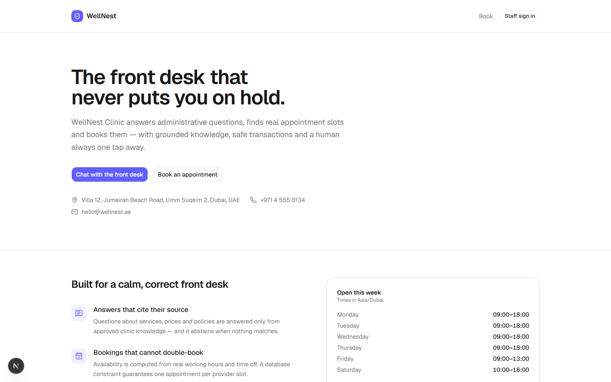
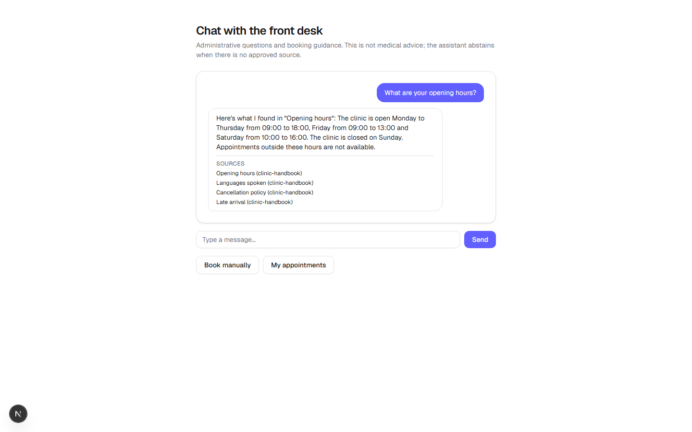
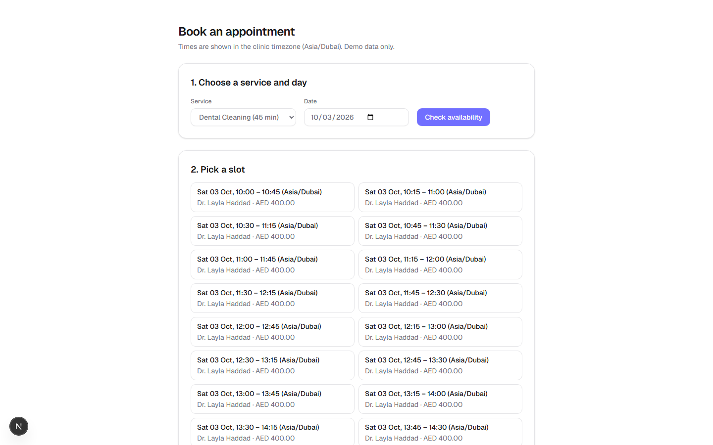
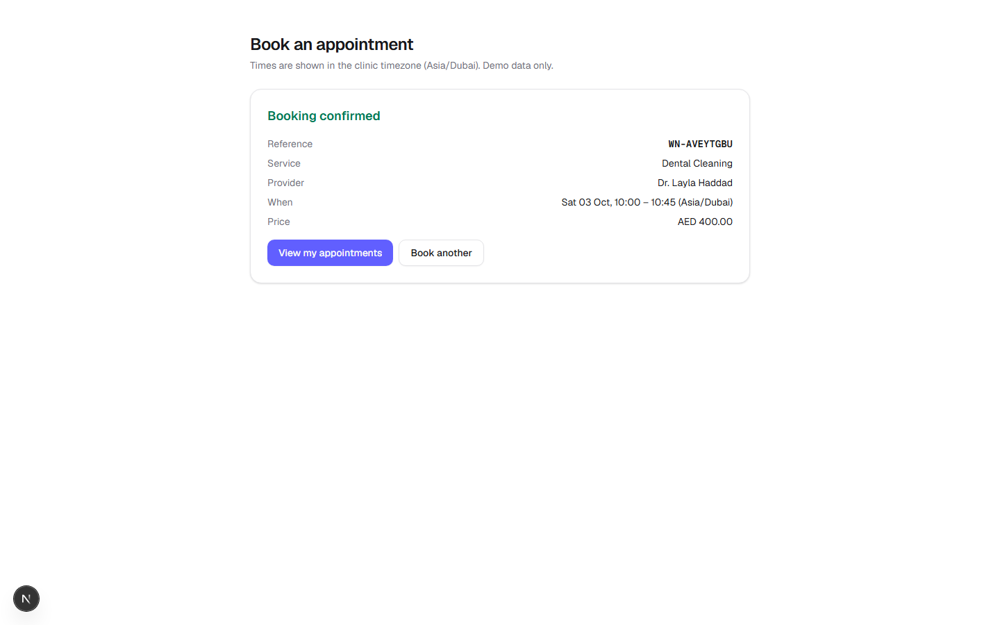
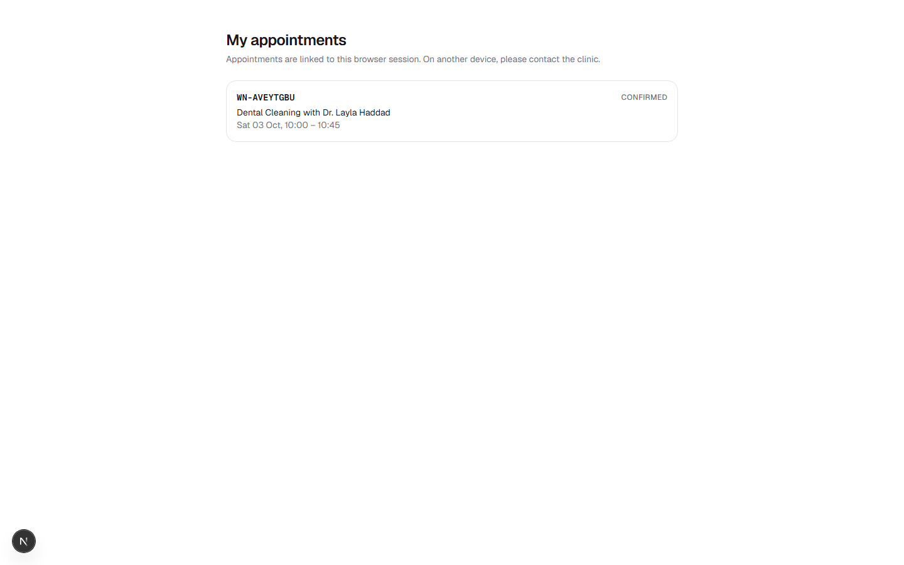

### Staff

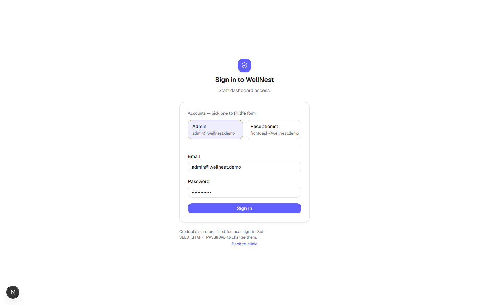
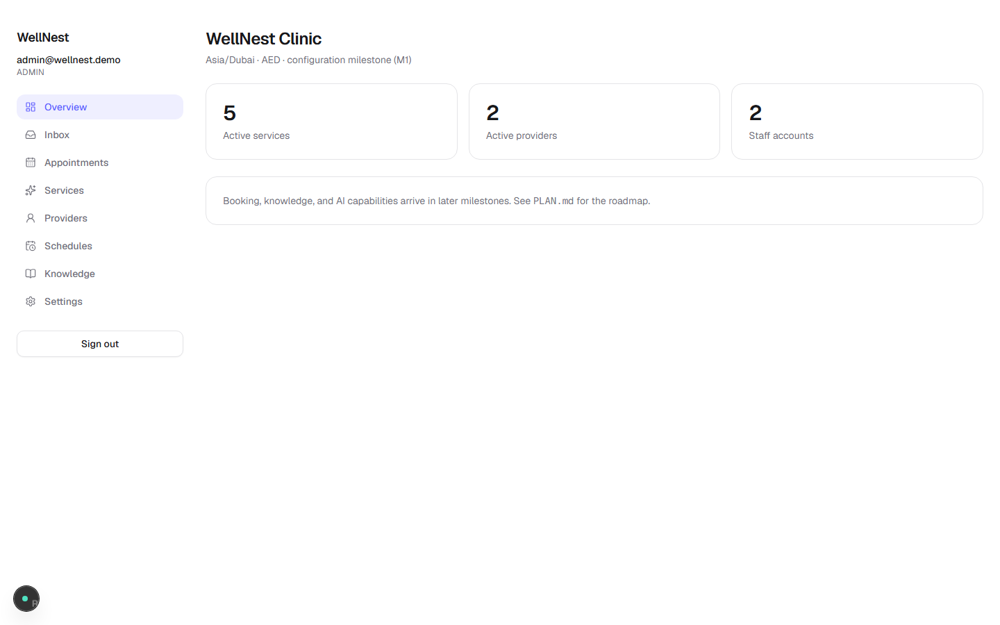
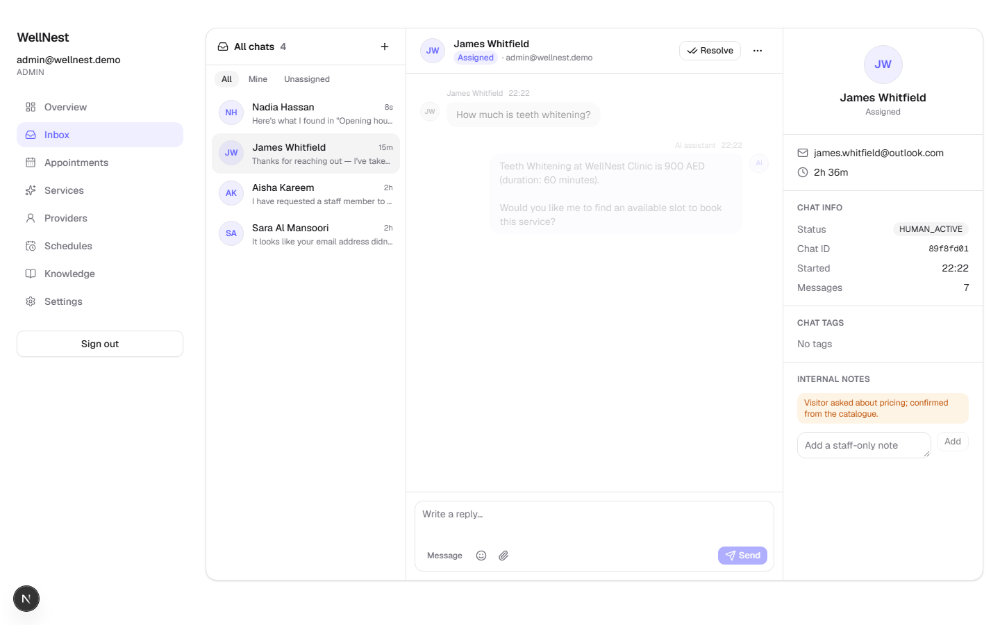
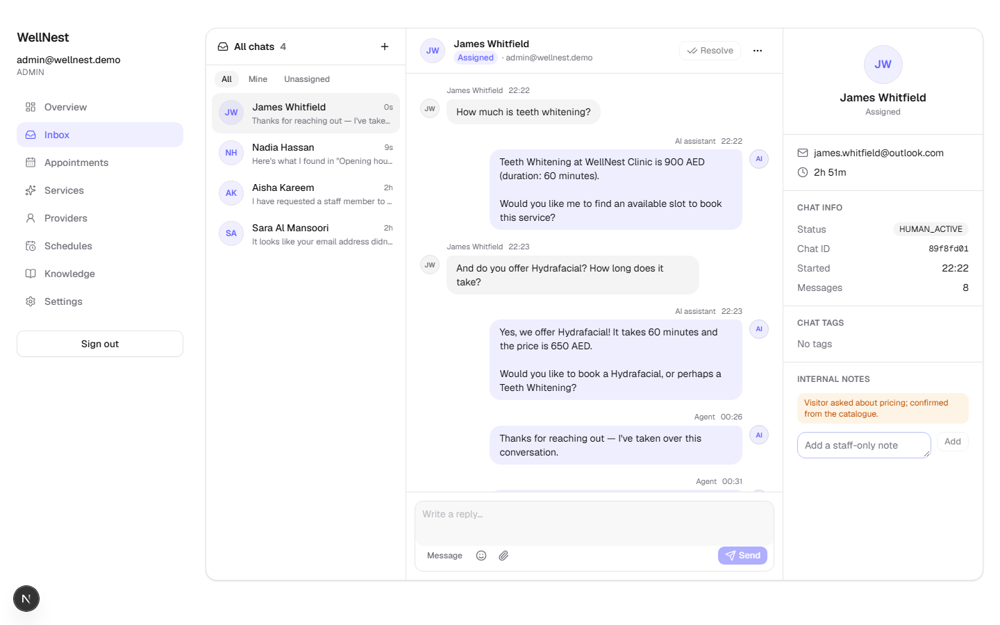
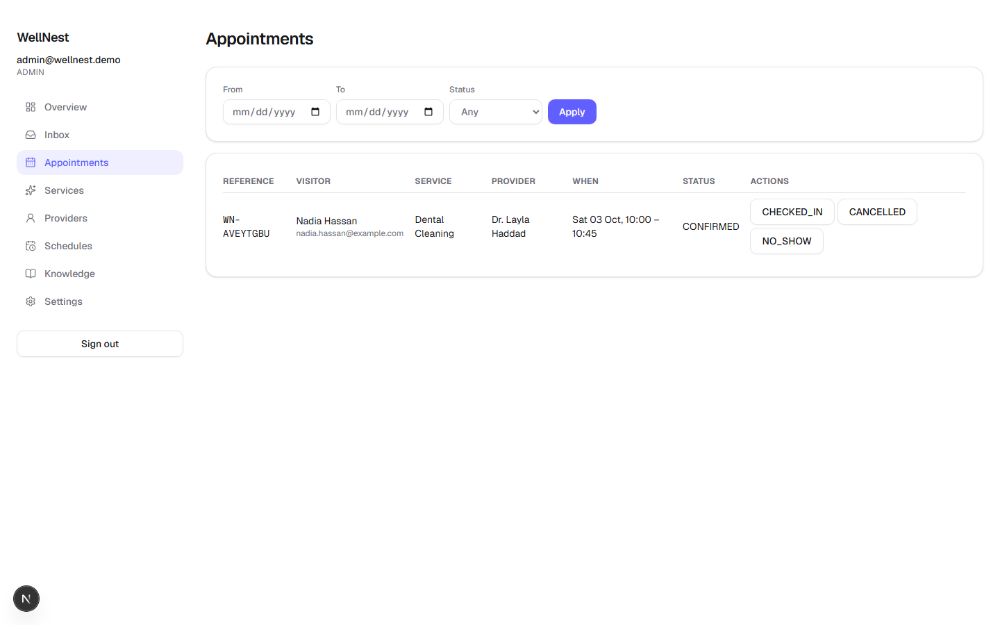
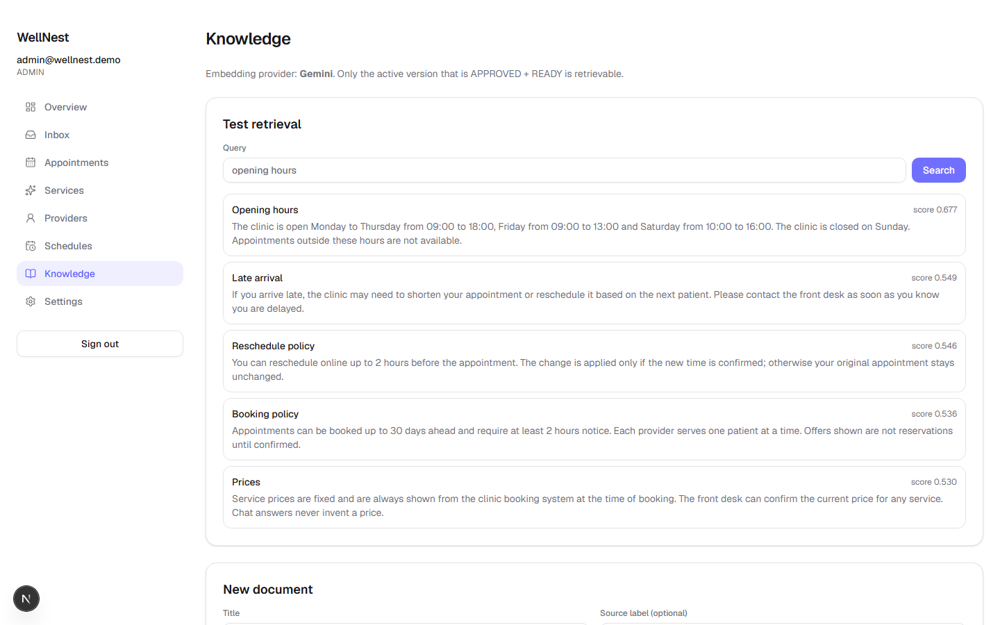
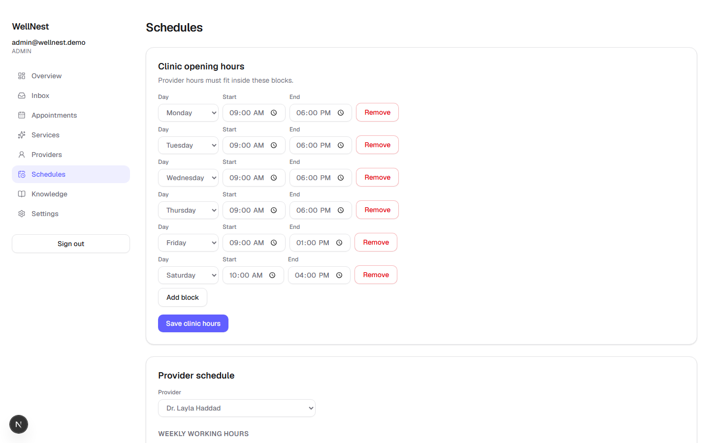

### Mobile

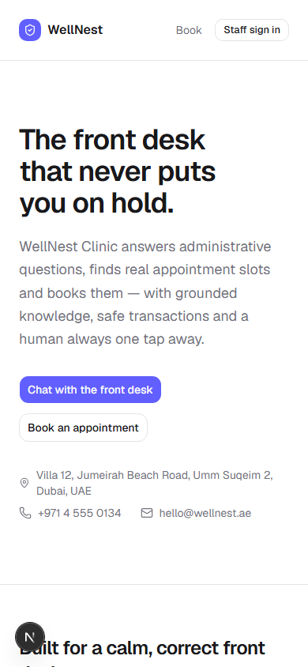
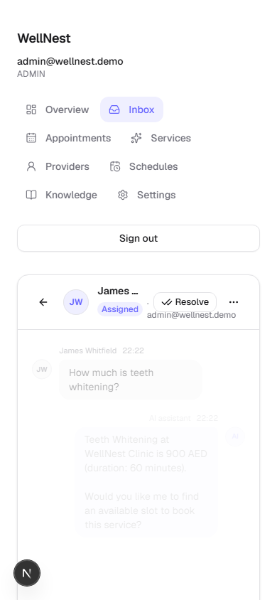

## API

All responses use the envelope `{ success, code, requestId, data, retryable }`
(see `src/lib/result.ts`). Error codes follow PRD section 16. All `/api/admin/*`
routes require an `ADMIN` staff session and enforce same-origin on mutations.

| Route | Method | Description |
|---|---|---|
| `/api/health` | GET | Liveness + database connectivity |
| `/api/guest-session` | POST | Create/reuse an opaque guest session (HttpOnly cookie) |
| `/api/staff/login` | POST | Staff login, sets a DB-backed session cookie |
| `/api/staff/logout` | POST | Revoke the staff session |
| `/api/me` | GET | Current actor: `staff`, `guest`, or `anonymous` |
| `/api/admin/settings` | GET, PATCH | Clinic policy settings |
| `/api/admin/services` | GET, POST | List / create services |
| `/api/admin/services/[id]` | PATCH, DELETE | Update / deactivate a service |
| `/api/admin/providers` | GET, POST | List / create providers |
| `/api/admin/providers/[id]` | PATCH | Update a provider |
| `/api/admin/clinic-hours` | GET, PUT | Clinic opening hours |
| `/api/admin/schedules/[providerId]` | GET, PUT | Provider working hours + time off |
| `/api/admin/schedule-exceptions` | POST | Add time off |
| `/api/admin/schedule-exceptions/[id]` | DELETE | Remove time off |
| `/api/chat` | GET, POST | Conversation history / send a message |
| `/api/services` | GET | Public list of active services |
| `/api/availability` | GET | Free slots for a service (no patient data) |
| `/api/bookings` | POST | Prepare a booking (creates a pending action) |
| `/api/bookings/reschedule` | POST | Prepare a reschedule |
| `/api/bookings/cancel` | POST | Prepare a cancellation |
| `/api/actions/[id]/confirm` | POST | Execute a pending action (guest-owned, idempotent) |
| `/api/my-appointments` | GET | Appointments owned by the guest session |
| `/api/staff/appointments` | GET | Clinic appointment list (filters) |
| `/api/staff/appointments/[id]` | PATCH | Staff status transition (audited) |
| `/api/staff/conversations` | GET | Inbox list |
| `/api/staff/conversations/[id]` | GET | Conversation detail (messages + notes) |
| `/api/staff/conversations/[id]/claim` | POST | Atomic claim/takeover |
| `/api/staff/conversations/[id]/reply` | POST | Staff reply |
| `/api/staff/conversations/[id]/notes` | POST | Internal note (staff only) |
| `/api/staff/conversations/[id]/resolve` | POST | Resolve conversation |
| `/api/admin/knowledge` | GET, POST | List / create knowledge documents |
| `/api/admin/knowledge/[documentId]` | PATCH | Enable/disable a document |
| `/api/admin/knowledge/[documentId]/versions` | POST | Add a new draft version |
| `/api/admin/knowledge/versions/[versionId]/approve` | POST | Approve + index a version |
| `/api/admin/knowledge/versions/[versionId]/disable` | POST | Disable a version |
| `/api/admin/knowledge/versions/[versionId]/reindex` | POST | Retry indexing |
| `/api/admin/knowledge/search` | GET | Retrieval test (returns citations) |

### Booking model

- Booking never happens from a model's text: the server creates a versioned,
  hashed, single-use **pending action**; only the owning guest session can
  confirm it, with an idempotency key.
- Overlaps are prevented at two levels: an application check and a Postgres
  **exclusion constraint** on `provider + tstzrange(startAt, occupiedEnd)` for
  active appointments (verified working on local Prisma Postgres).
- Every mutation writes an `audit_events` row in the same transaction.

### Chat agent

- The agent has read tools (`searchClinicKnowledge`, `getClinicServices`,
  `getAvailableSlots`, `getOwnedAppointments`) and action tools that only
  **prepare** a pending action (`prepareBooking`, `prepareReschedule`,
  `prepareCancellation`, `requestHumanHandoff`). The model can never confirm.
- With `GEMINI_API_KEY`, it runs Gemini through the Vercel AI SDK with tool
  calling capped at 6 steps. Without a key, a deterministic keyword fallback
  agent answers from approved knowledge, guides booking, and abstains when
  there is no grounded source.
- Messages are persisted with idempotency per `clientMessageId`; a retry
  returns the same reply.

### Human desk

- Requesting staff opens a handoff ticket and sets the conversation to
  `WAITING_HUMAN`; the AI stops replying from that point.
- Claiming is atomic on the conversation `version`: two staff claiming at once
  — only one wins, the other gets `VERSION_CONFLICT`. Claiming also cancels the
  visitor's pending AI actions.
- Internal notes live in their own table and are never returned by the visitor
  serializer. Staff replies use role `STAFF` and are visible to the visitor.
- The inbox polls every 5 seconds, pausing when the tab is hidden.

### Knowledge retrieval (no external memory service)

- Documents have immutable versions; editing creates a new DRAFT version. The
  previous version stays active until the new one is **APPROVED + READY**.
- Embeddings are stored in a `vector(768)` column with an HNSW cosine index
  (`pgvector`). Prisma cannot type `vector`, so it is read/written with raw SQL.
- Retrieval always re-validates against the database: only the active version of
  an active document that is APPROVED + READY is eligible. `DISABLED` versions
  drop out immediately.
- Embeddings use **Gemini** (`gemini-embedding-001`) when `GEMINI_API_KEY` is
  set; otherwise a deterministic local fallback is used so the pipeline and
  tests work offline. Retrieval degrades to keyword search if the provider
  fails, and never fabricates an answer.

## Project structure

```
prisma/
  schema.prisma            # domain schema
  migrations/              # versioned SQL (incl. pgvector extension)
  seed.ts                  # clinic profile, staff, services, knowledge
scripts/
  smoke.mjs                # runtime smoke test
src/
  app/                     # App Router pages + API routes
  components/
    booking/               # visitor booking flow (client)
    staff/                 # staff dashboard components (client)
  lib/                     # db, env, result envelope, http, logger, rate limit
  modules/
    auth/                  # guest + staff sessions, password hashing, RBAC
    clinic/                # settings, services, providers, schedules, validation
    scheduling/            # timezone-aware availability engine
    appointments/          # booking domain: actions, idempotency, create/reschedule/cancel
    knowledge/             # documents, versions, embeddings, pgvector retrieval
    conversations/         # conversation + message persistence, staff desk
    ai/                    # agent, intent, tools, chat orchestration
    audit/                 # audit event writer
  generated/prisma/        # generated client (gitignored)
tests/                     # Vitest unit tests
tests/integration/         # database-backed tests (pnpm test:integration)
docs/SPIKE_RESULTS.md      # M0 verification evidence
```

## QA and evaluation

- `pnpm test` — unit tests (no database).
- `pnpm test:integration` — database-backed tests for booking, knowledge,
  chat, and the human desk, including the overlap constraint, contested slots,
  handoff, and a retrieval failure-injection case.
- `pnpm smoke` — 39 end-to-end runtime checks against a running server.
- `pnpm eval` — runs the labeled dataset in `evals/knowledge-dataset.json`
  (15 answerable, 10 unanswerable, 10 booking, 5 injection; 25 dev / 15
  holdout) and enforces the PRD quality gate: answerable grounded ≥ 90% and
  abstain ≥ 90%. Current result: 100% / 100% / 100%.

## Known limitations

- Local Prisma Postgres (PGlite) supports only **one connection**, so it cannot
  be used for the concurrency gate. Use hosted Prisma Postgres for that.
- Rate limiting is in-memory (per instance); persistent limiting is required
  before production.
- The **true parallel concurrency gate** (`AT-08`: 20 simultaneous requests for
  one slot) is written but skipped by default, because local Prisma Postgres is
  single-connection and crashes under concurrent transactions. Run it against
  hosted Prisma Postgres with `RUN_CONCURRENCY_GATE=1 pnpm test:integration`.
  A deterministic 20-attempt test passes locally today.
- Schedule changes are not yet rejected when they conflict with a **confirmed
  appointment** (PRD section 6); that check arrives with the staff appointment
  dashboard in M5. Capacity conflicts are still impossible because of the
  exclusion constraint.
- Reschedule/cancel have API and domain support but no visitor UI yet.
- Without `GEMINI_API_KEY`, embeddings use a lexical local fallback and the chat
  agent uses a keyword fallback instead of Gemini. Semantic quality and
  model-driven tool use require the real key.
- Chat responses are returned in one JSON response; token streaming and the
  Gemini path are implemented but not yet runtime-tested without a key.
- Local Prisma Postgres is single-connection and unstable under concurrent
  queries; some paths (dashboard, conversation detail) intentionally run
  queries sequentially for that reason. Hosted Prisma Postgres removes this.
- Notification/reminder delivery is out of scope for P0.
- The evaluation currently scores the **offline fallback** agent and a lexical
  retrieval fallback; the gate must be re-run with `GEMINI_API_KEY` to score the
  semantic (Gemini) path. The deployment gate (M7) is not done yet.

## Documentation

- [`PLAN.md`](./PLAN.md) — staged delivery plan and stack decisions
- [`docs/SPIKE_RESULTS.md`](./docs/SPIKE_RESULTS.md) — M0 spike evidence and pinned versions
